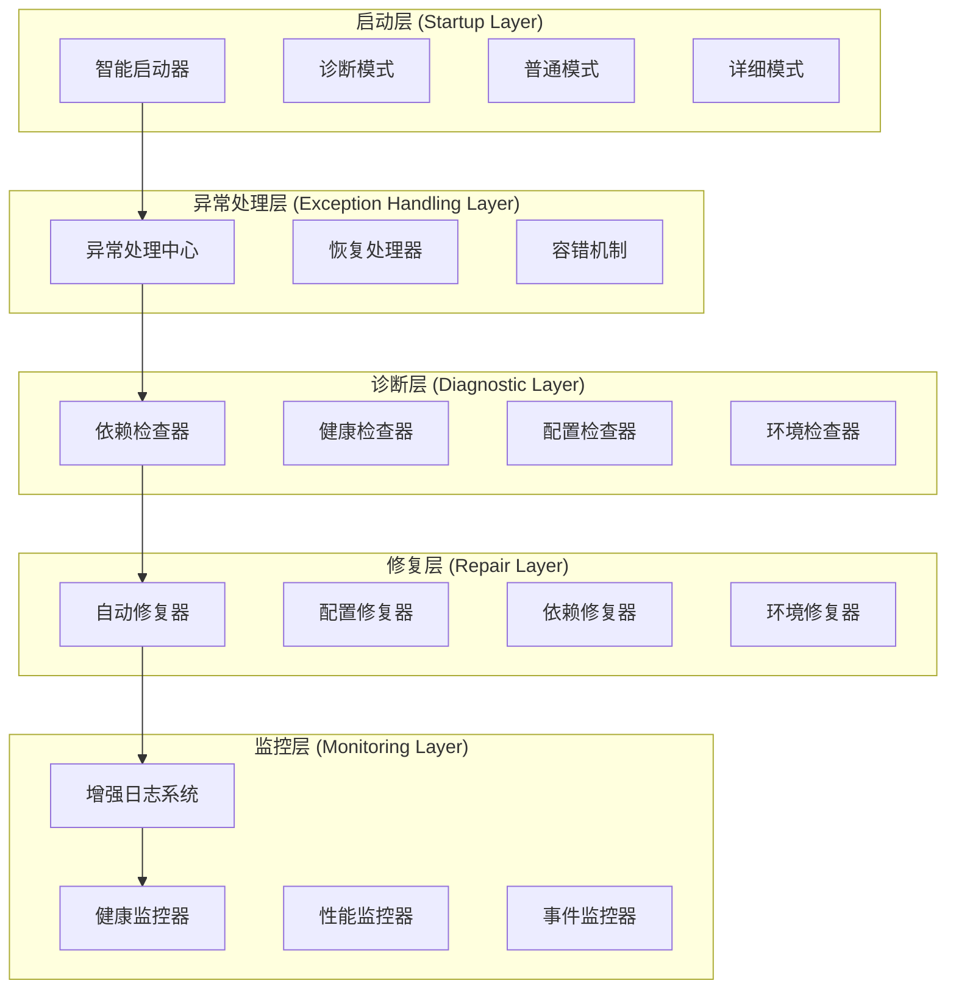
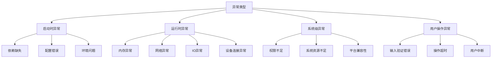
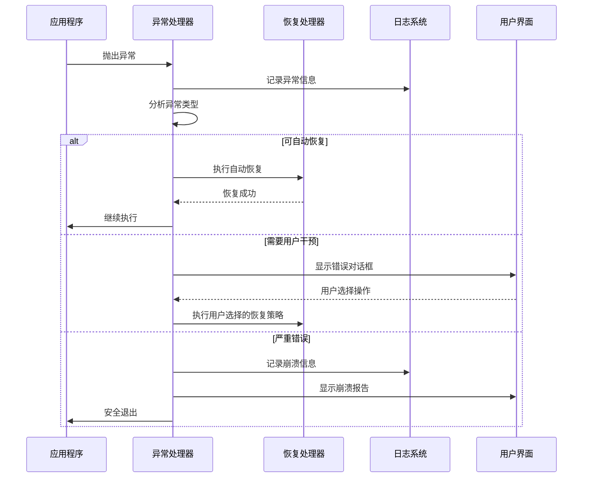
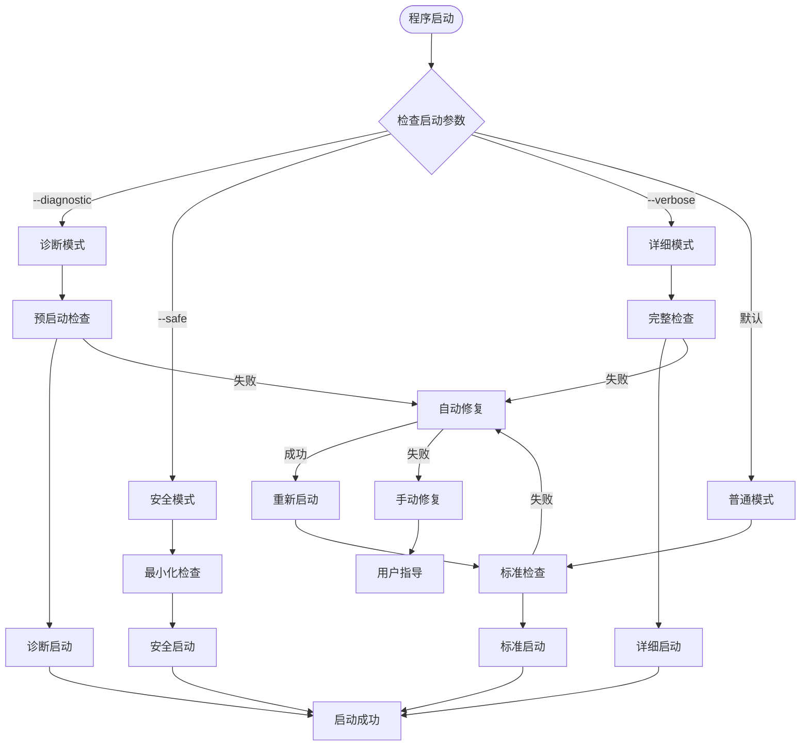
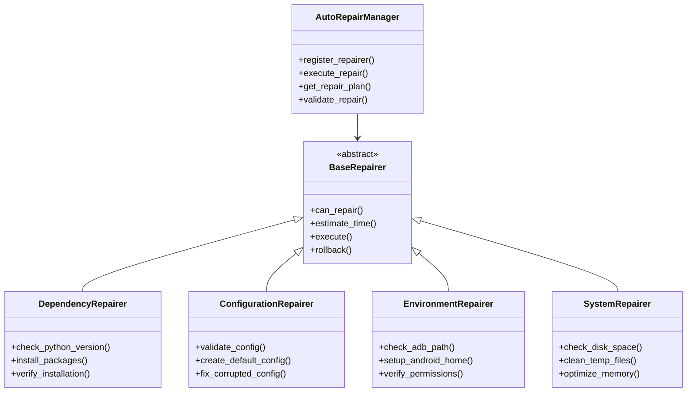
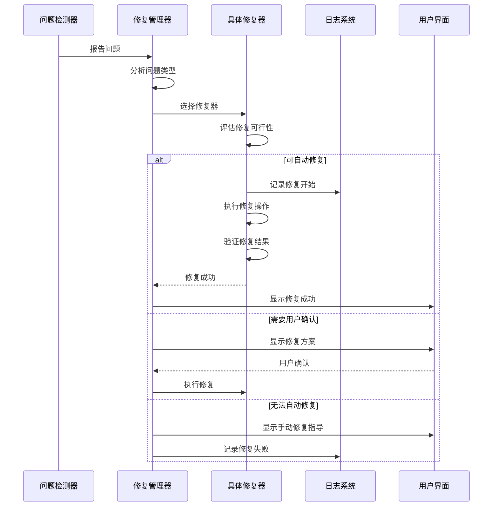
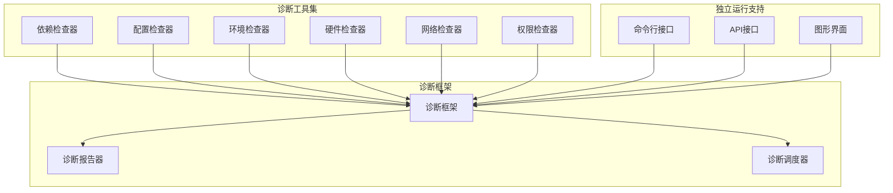
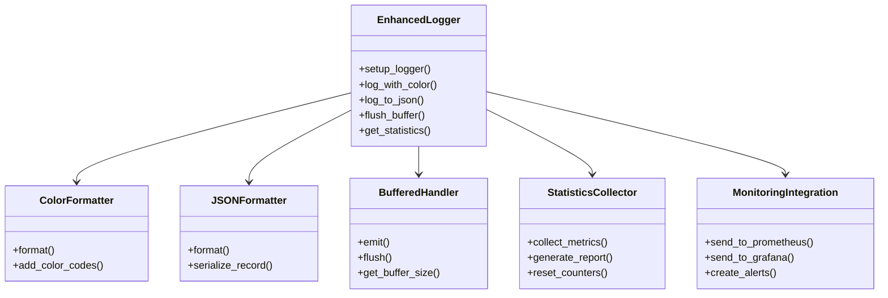
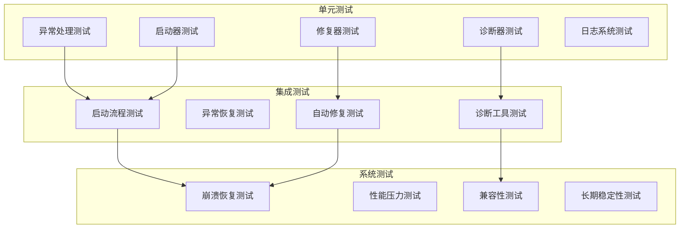

# Android系统修复工具闪退问题修复设计文档

## 概述

Android系统修复工具闪退问题修复方案旨在通过多层次异常处理策略、智能启动机制、自动修复体系和模块化诊断工具，全面解决应用程序闪退问题，确保工具的稳定性和可靠性。

## 技术架构

### 整体架构设计



## 多层次异常处理策略

### 异常分类体系



### 异常处理架构

| 处理层级 | 责任范围 | 处理策略 | 恢复机制 |
|---------|---------|---------|---------|
| 预防层 | 启动前检查 | 依赖验证、环境检查 | 自动安装、配置修复 |
| 捕获层 | 异常拦截 | 全局异常处理 | 错误日志、状态保存 |
| 恢复层 | 故障恢复 | 自动重试、降级处理 | 备用方案、安全模式 |
| 通知层 | 用户反馈 | 友好错误提示 | 解决方案建议 |

### 异常处理流程



## 智能启动机制

### 启动模式设计

| 启动模式 | 用途 | 特点 | 适用场景 |
|---------|------|------|---------|
| 普通模式 | 正常使用 | 标准功能、最小日志 | 日常操作 |
| 诊断模式 | 问题排查 | 详细检查、扩展日志 | 故障排除 |
| 安全模式 | 故障恢复 | 最小功能、核心模块 | 严重故障时 |
| 详细模式 | 开发调试 | 完整日志、性能监控 | 开发测试 |

### 智能启动流程



### 启动参数规范

```bash
# 普通启动
python main.py

# 诊断模式启动
python main.py --diagnostic --log-level=DEBUG

# 安全模式启动  
python main.py --safe --minimal-ui

# 详细模式启动
python main.py --verbose --performance-monitor

# 配置检查模式
python main.py --check-config --no-gui

# 依赖验证模式
python main.py --check-deps --fix-missing
```

## 自动修复体系

### 修复器架构



### 修复策略矩阵

| 问题类型 | 检测方法 | 自动修复策略 | 备用方案 | 成功率 |
|---------|---------|-------------|---------|--------|
| Python版本不匹配 | 版本检查 | 提示升级 | 兼容性模式 | 90% |
| 依赖包缺失 | 导入测试 | pip自动安装 | 手动安装指导 | 95% |
| ADB工具缺失 | PATH检查 | 自动下载安装 | 手动配置路径 | 85% |
| 配置文件损坏 | 格式验证 | 重建默认配置 | 备份恢复 | 98% |
| 权限不足 | 权限测试 | 提升权限提示 | 降级功能 | 70% |
| 磁盘空间不足 | 空间检查 | 自动清理 | 用户手动清理 | 80% |

### 修复执行流程



## 模块化诊断工具

### 诊断工具架构



### 诊断工具规范

| 诊断工具 | 独立命令 | 检查内容 | 输出格式 | 运行时间 |
|---------|---------|---------|---------|---------|
| 依赖检查器 | `python -m src.utils.dependency_checker` | Python版本、必需包、可选包 | JSON/文本 | < 30s |
| 配置检查器 | `python -m src.utils.config_validator` | 配置文件完整性、参数有效性 | JSON/文本 | < 10s |
| 环境检查器 | `python -m src.utils.environment_checker` | ADB路径、Android SDK、权限 | JSON/文本 | < 20s |
| 硬件检查器 | `python -m src.utils.hardware_checker` | CPU、内存、磁盘、USB端口 | JSON/文本 | < 15s |
| 网络检查器 | `python -m src.utils.network_checker` | 连接性、代理设置、防火墙 | JSON/文本 | < 25s |
| 权限检查器 | `python -m src.utils.permission_checker` | 文件权限、管理员权限 | JSON/文本 | < 10s |

### 诊断报告格式

```json
{
  "diagnostic_report": {
    "timestamp": "2024-01-15T10:30:00Z",
    "version": "1.0.0",
    "system_info": {
      "os": "Windows 10",
      "python_version": "3.9.7",
      "architecture": "x64"
    },
    "checks": [
      {
        "checker": "dependency_checker",
        "status": "passed",
        "duration": 12.5,
        "details": {
          "python_version": {
            "required": ">=3.8",
            "current": "3.9.7",
            "status": "ok"
          },
          "packages": {
            "missing": [],
            "outdated": ["requests"],
            "status": "warning"
          }
        }
      }
    ],
    "overall_status": "warning",
    "recommendations": [
      "升级requests包到最新版本"
    ]
  }
}
```

## 增强的日志系统

### 日志系统架构



### 日志格式规范

| 输出模式 | 格式 | 用途 | 示例 |
|---------|------|------|------|
| 彩色文本 | `[时间] [级别] [模块] 消息` | 开发调试 | `🟢 [10:30:15] [INFO] [DeviceManager] 设备连接成功` |
| JSON格式 | 结构化JSON | 日志分析 | `{"timestamp":"2024-01-15T10:30:15Z","level":"INFO","module":"DeviceManager","message":"设备连接成功"}` |
| 缓冲模式 | 批量写入 | 高性能场景 | 缓冲1000条日志后批量写入文件 |
| 监控模式 | 指标统计 | 系统监控 | `ERROR_COUNT=5, WARN_COUNT=12, RESPONSE_TIME=150ms` |

### 日志配置示例

```yaml
logging:
  version: 1
  formatters:
    colored:
      format: '[{asctime}] [{levelname:8}] [{name}] {message}'
      style: '{'
      class: 'src.utils.logger.ColorFormatter'
    
    json:
      format: '{"timestamp":"{asctime}","level":"{levelname}","logger":"{name}","message":"{message}","module":"{module}","function":"{funcName}","line":{lineno}}'
      class: 'src.utils.logger.JSONFormatter'
  
  handlers:
    console:
      class: logging.StreamHandler
      formatter: colored
      level: INFO
      
    file:
      class: logging.handlers.RotatingFileHandler
      formatter: json
      filename: logs/app.log
      maxBytes: 10485760  # 10MB
      backupCount: 5
      
    buffer:
      class: 'src.utils.logger.BufferedHandler'
      formatter: json
      buffer_size: 1000
      flush_interval: 60
  
  loggers:
    root:
      level: INFO
      handlers: [console, file]
      
    src.core:
      level: DEBUG
      handlers: [console, file, buffer]
      propagate: false
```

## 核心组件设计

### 异常处理中心

```python
class ExceptionHandlingCenter:
    """异常处理中心"""
    
    def __init__(self):
        self.handlers = {}
        self.recovery_strategies = {}
        self.fallback_actions = {}
    
    def register_handler(self, exception_type, handler):
        """注册异常处理器"""
        pass
    
    def handle_exception(self, exception, context=None):
        """处理异常"""
        pass
    
    def execute_recovery(self, strategy_name, **kwargs):
        """执行恢复策略"""
        pass
```

### 智能启动器

```python
class IntelligentStarter:
    """智能启动器"""
    
    def __init__(self):
        self.startup_modes = {}
        self.checkers = []
        self.repairers = []
    
    def parse_arguments(self, args):
        """解析启动参数"""
        pass
    
    def select_startup_mode(self, mode_name):
        """选择启动模式"""
        pass
    
    def execute_startup_checks(self):
        """执行启动检查"""
        pass
    
    def start_application(self):
        """启动应用程序"""
        pass
```

### 自动修复管理器

```python
class AutoRepairManager:
    """自动修复管理器"""
    
    def __init__(self):
        self.repairers = {}
        self.repair_history = []
    
    def register_repairer(self, problem_type, repairer):
        """注册修复器"""
        pass
    
    def diagnose_and_repair(self, problem):
        """诊断并修复问题"""
        pass
    
    def create_repair_plan(self, problems):
        """创建修复计划"""
        pass
    
    def execute_repair_plan(self, plan):
        """执行修复计划"""
        pass
```

## 测试策略

### 测试架构



### 关键测试用例

| 测试类型 | 测试场景 | 验证点 | 预期结果 |
|---------|---------|--------|---------|
| 异常处理 | 依赖缺失启动 | 自动安装依赖 | 启动成功 |
| 智能启动 | 诊断模式启动 | 详细检查执行 | 生成诊断报告 |
| 自动修复 | 配置文件损坏 | 自动重建配置 | 恢复正常功能 |
| 日志系统 | 高并发日志 | 缓冲处理性能 | 无日志丢失 |
| 崩溃恢复 | 内存不足崩溃 | 自动重启恢复 | 状态完整恢复 |


