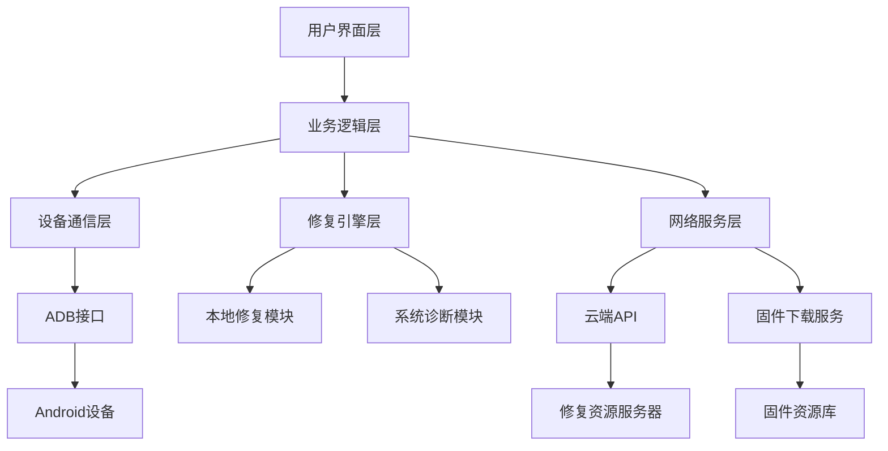
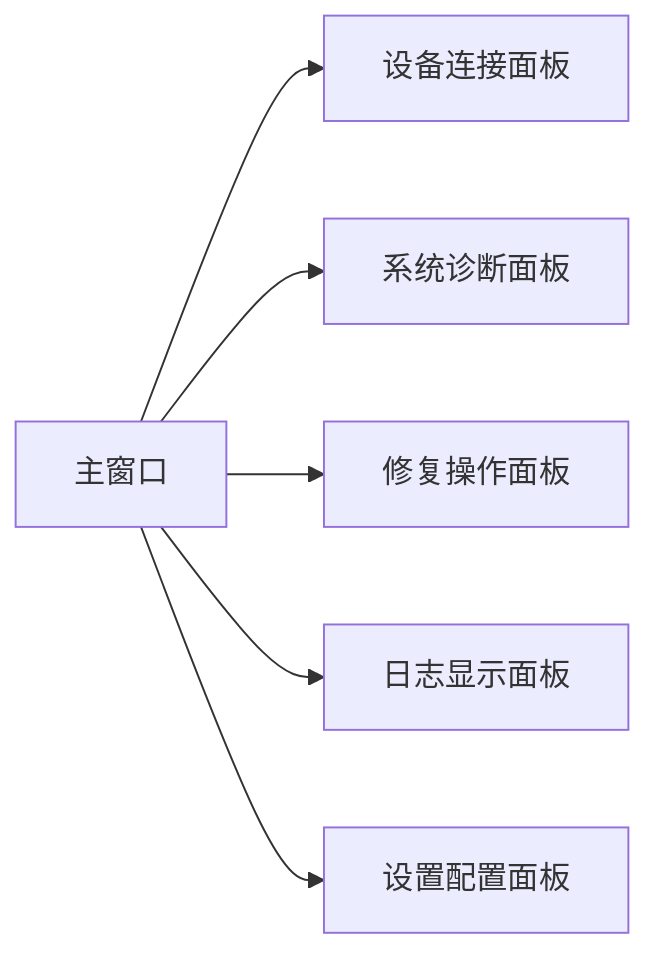
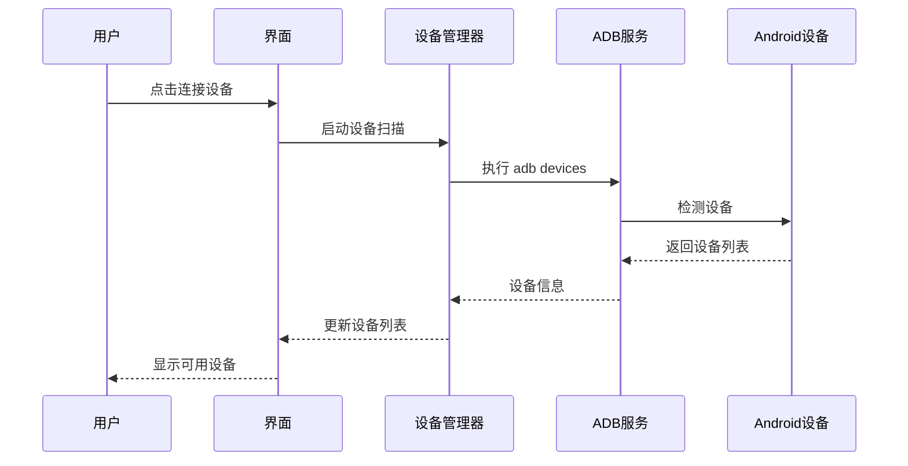
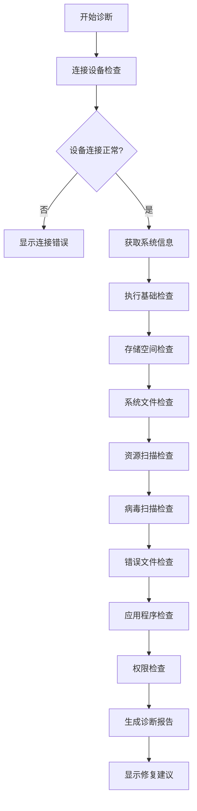
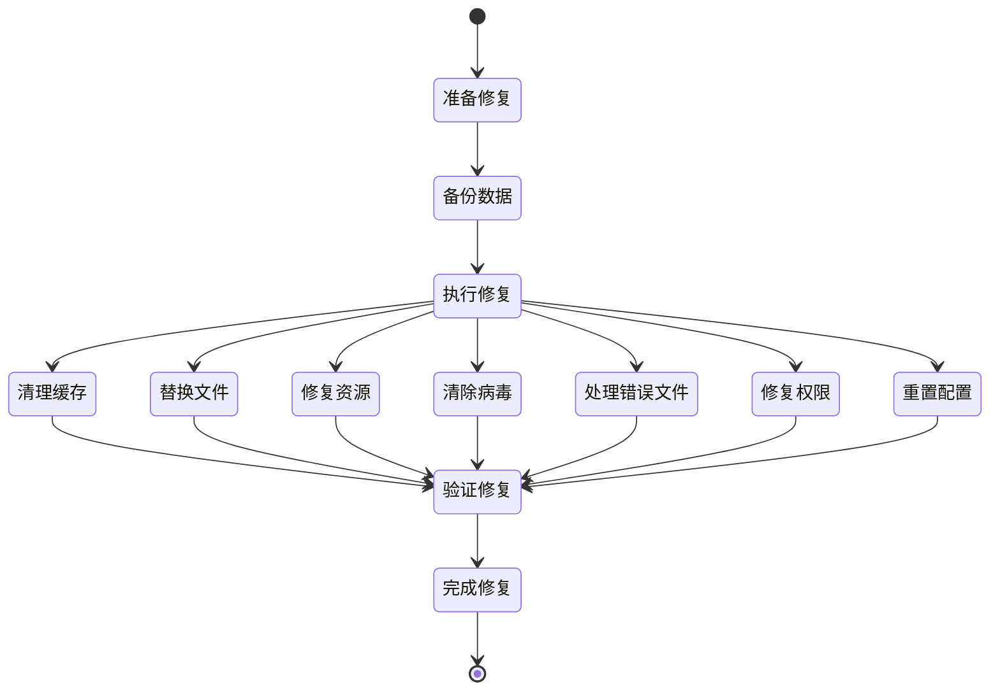
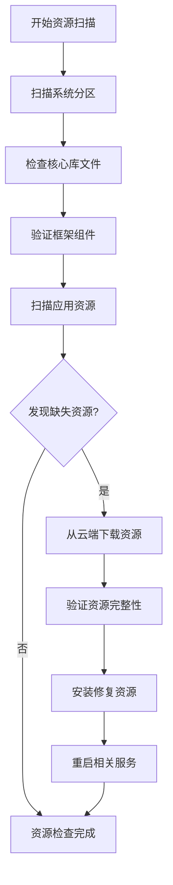
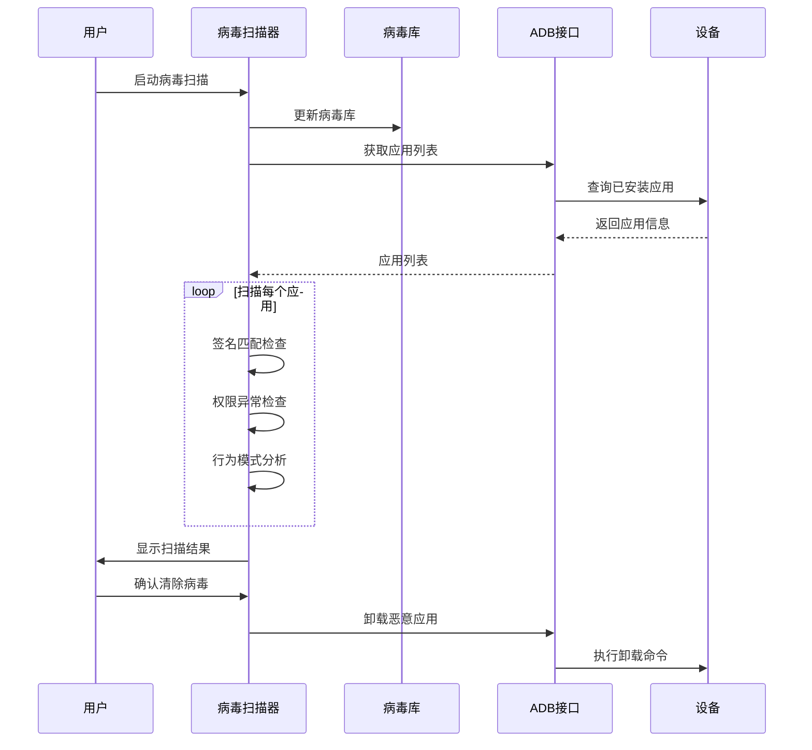
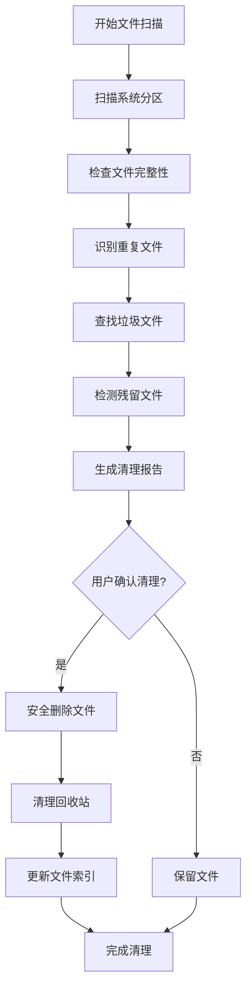
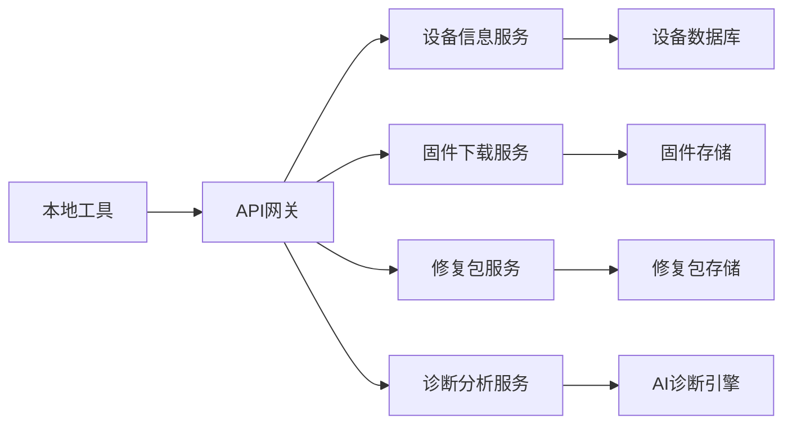

# 安卓系统修复工具设计文档

## 项目概述

本项目旨在开发一个基于Python的图形化界面工具，用于诊断和修复安卓设备的系统问题。该工具将提供本地修复功能和联网修复服务，为用户提供全方位的安卓系统维护解决方案。

### 核心价值
- 提供用户友好的图形化修复界面
- 支持多种安卓系统问题的自动诊断
- 集成本地和云端修复资源
- 实现自动化的系统修复流程

## 技术栈与依赖

### 核心技术栈
- **GUI框架**: Tkinter / PyQt5/6 / Kivy
- **Android调试**: ADB (Android Debug Bridge)
- **网络请求**: requests, urllib3
- **文件处理**: zipfile, tarfile, shutil
- **系统交互**: subprocess, os, platform
- **配置管理**: configparser, json
- **日志记录**: logging

### 第三方依赖
```
adb-shell>=0.4.0
requests>=2.28.0
tkinter (内置)
pillow>=9.0.0
psutil>=5.9.0
hashlib (内置)  # 文件哈希计算
yara-python>=4.0.0  # 病毒特征匹配
pyclamd>=0.5.0  # ClamAV病毒扫描
magic>=0.4.27  # 文件类型检测
watchdog>=2.1.0  # 文件系统监控
```

## 系统架构

### 整体架构图


### 核心组件架构

#### 1. 用户界面层 (UI Layer)


#### 2. 业务逻辑层 (Business Logic Layer)
- **设备管理器**: 负责Android设备的连接、检测和状态监控
- **诊断引擎**: 执行系统问题的自动化诊断
- **修复调度器**: 协调各种修复操作的执行顺序
- **配置管理器**: 管理工具设置和用户偏好

#### 3. 设备通信层 (Device Communication Layer)
- **ADB连接管理**: 建立和维护与Android设备的ADB连接
- **命令执行器**: 执行ADB命令和Shell脚本
- **文件传输器**: 处理与设备之间的文件传输

## 功能模块设计

### 1. 设备连接与检测模块

#### 功能特性
- 自动检测连接的Android设备
- 显示设备基本信息（型号、Android版本、ROOT状态）
- 支持USB和WiFi ADB连接
- 设备连接状态监控

#### 核心流程


### 2. 系统诊断模块

#### 诊断项目
| 诊断类别 | 检测内容 | 修复方式 |
|---------|----------|----------|
| 存储空间 | 系统分区空间、缓存占用 | 清理缓存、移动数据 |
| 系统文件 | 关键系统文件完整性 | 替换损坏文件 |
| 资源扫描 | 丢失的系统资源、库文件、框架组件 | 重新安装缺失资源 |
| 病毒检测 | 恶意应用、木马程序、可疑进程 | 隔离并清除病毒 |
| 错误文件 | 损坏文件、冗余文件、垃圾文件 | 删除或修复错误文件 |
| 应用程序 | 冲突应用、恶意软件 | 卸载问题应用 |
| 权限问题 | ROOT权限、系统权限 | 权限修复 |
| 网络配置 | DNS设置、网络连接 | 重置网络配置 |
| 启动问题 | Bootloader、Recovery | 刷写修复分区 |

#### 诊断流程


### 3. 本地修复引擎

#### 修复类型与方法
- **清理修复**: 清除缓存、临时文件、无用数据
- **文件修复**: 替换损坏的系统文件
- **资源修复**: 重新安装丢失的系统资源、库文件、框架组件
- **病毒清除**: 扫描并移除恶意软件、木马程序、可疑进程
- **错误文件处理**: 识别并删除损坏、冗余、垃圾文件
- **权限修复**: 修复文件和应用权限问题
- **配置修复**: 重置系统配置到默认状态
- **应用修复**: 修复或重装有问题的应用

#### 修复操作流程


### 5. 资源扫描与修复模块

#### 资源扫描功能
- **系统资源检查**: 扫描Android系统核心资源文件
- **应用资源检查**: 检查已安装应用的资源完整性
- **库文件扫描**: 验证系统库文件和依赖项
- **框架组件检查**: 检查Android框架组件完整性

#### 资源修复流程


#### 检查的资源类型
- `/system/lib/` 系统库文件
- `/system/framework/` 框架JAR文件
- `/system/app/` 系统应用资源
- `/system/etc/` 配置文件
- `/data/dalvik-cache/` Dalvik缓存文件

### 6. 病毒检测与清除模块

#### 病毒检测技术
- **签名匹配**: 基于已知恶意软件签名数据库
- **行为分析**: 监控可疑应用行为模式
- **权限分析**: 检查应用权限异常请求
- **网络监控**: 检测异常网络通信
- **进程监控**: 识别可疑后台进程

#### 病毒检测流程


#### 病毒特征库
- **恶意应用签名**: MD5/SHA256哈希值数据库
- **可疑权限组合**: 异常权限请求模式
- **恶意行为模式**: 后台上传数据、频繁定位等
- **网络黑名单**: 已知恶意服务器地址

#### 病毒清除策略
- **隔离处理**: 先隔离可疑文件，确认后删除
- **深度清除**: 清理恶意应用残留文件和注册表项
- **系统修复**: 修复被病毒篡改的系统设置
- **防护加固**: 启用系统安全防护机制

### 7. 错误文件检测与清理模块

#### 错误文件类型
- **损坏文件**: 文件完整性校验失败的文件
- **冗余文件**: 重复或不再需要的文件
- **垃圾文件**: 临时文件、缓存文件、日志文件
- **残留文件**: 卸载应用后遗留的文件
- **无效链接**: 指向不存在文件的符号链接

#### 错误文件检测算法
```python
# 文件完整性检查示例
def check_file_integrity(file_path, expected_hash):
    """
    检查文件完整性
    """
    if not os.path.exists(file_path):
        return False, "文件不存在"
    
    actual_hash = calculate_file_hash(file_path)
    if actual_hash != expected_hash:
        return False, "文件哈希值不匹配"
    
    return True, "文件完整"

def scan_duplicate_files(scan_path):
    """
    扫描重复文件
    """
    file_hashes = {}
    duplicates = []
    
    for root, dirs, files in os.walk(scan_path):
        for file in files:
            file_path = os.path.join(root, file)
            file_hash = calculate_file_hash(file_path)
            
            if file_hash in file_hashes:
                duplicates.append((file_path, file_hashes[file_hash]))
            else:
                file_hashes[file_hash] = file_path
    
    return duplicates
```

#### 清理策略


#### 安全清理机制
- **备份重要文件**: 删除前创建备份
- **分级清理**: 按风险级别分类处理
- **用户确认**: 重要文件删除需用户确认
- **回滚功能**: 支持撤销删除操作

### 8. 网络修复服务

#### 云端修复功能
- **固件下载**: 从官方或可信源下载系统固件
- **修复包获取**: 获取针对特定问题的修复补丁
- **在线诊断**: 上传设备信息进行云端分析
- **社区支持**: 访问用户社区和解决方案数据库

#### 网络服务架构


## 数据模型设计

### 设备信息模型
```python
class DeviceInfo:
    device_id: str
    model: str
    android_version: str
    build_number: str
    root_status: bool
    storage_total: int
    storage_free: int
    connection_type: str  # USB/WiFi
    last_connected: datetime
```

### 诊断报告模型
```python
class DiagnosticReport:
    device_id: str
    scan_time: datetime
    issues_found: List[Issue]
    system_health_score: int
    recommendations: List[Recommendation]
    
class Issue:
    category: str  # STORAGE/SYSTEM_FILES/RESOURCES/VIRUS/ERROR_FILES/APPS/PERMISSIONS/NETWORK/BOOT
    severity: str  # LOW/MEDIUM/HIGH/CRITICAL
    description: str
    auto_fixable: bool
    fix_method: str
    affected_files: List[str]  # 受影响的文件列表
    
class VirusReport:
    malware_count: int
    suspicious_apps: List[str]
    threat_level: str
    quarantine_files: List[str]
    
class ResourceReport:
    missing_resources: List[str]
    corrupted_libraries: List[str]
    framework_issues: List[str]
    repair_available: bool
```

### 修复任务模型
```python
class RepairTask:
    task_id: str
    device_id: str
    task_type: str
    status: str  # PENDING/RUNNING/COMPLETED/FAILED
    progress: int
    start_time: datetime
    estimated_duration: int
    logs: List[str]
```

## 用户界面设计

### 主界面布局
```
┌─────────────────────────────────────────────────────┐
│ 安卓系统修复工具 v1.0                    [设置] [帮助] │
├─────────────────────────────────────────────────────┤
│ 设备连接 │ 系统诊断 │ 病毒扫描 │ 修复操作 │ 日志查看 │ 关于 │
├─────────────────────────────────────────────────────┤
│                                                     │
│  [设备列表区域]              [操作按钮区域]           │
│  ┌─────────────────┐         ┌─────────────────┐     │
│  │ 设备1: Mi 10    │         │ [连接设备]      │     │
│  │ Android 11      │         │ [开始诊断]      │     │
│  │ 已连接          │         │ [病毒扫描]      │     │
│  └─────────────────┘         │ [一键修复]      │     │
│                             │ [高级修复]      │     │
│  [诊断结果区域]              │ [备份数据]      │     │
│  ┌─────────────────────────────────────────┐         │
│  │ 系统健康评分: 85/100                    │         │
│  │ 发现问题: 5个 │ 检测到病毒: 2个        │         │
│  │ - 存储空间不足 (高优先级)               │         │
│  │ - 系统资源缺失 (中优先级)               │         │
│  │ - 发现恶意软件 (关键)                  │         │
│  │ - 缓存文件过多 (中优先级)               │         │
│  │ - 权限配置异常 (低优先级)               │         │
│  └─────────────────────────────────────────┘         │
│                                                     │
│  [修复进度区域]                                      │
│  ┌─────────────────────────────────────────┐         │
│  │ 正在修复: 清除恶意软件...               │         │
│  │ ████████████╬╬╬╬╬╬╬╬ 60%                │         │
│  │ 预计剩余时间: 3分钟                     │         │
│  └─────────────────────────────────────────┘         │
└─────────────────────────────────────────────────────┘
```
│  │ ████████████░░░░░░░░ 60%                │         │
│  │ 预计剩余时间: 2分钟                     │         │
│  └─────────────────────────────────────────┘         │
└─────────────────────────────────────────────────────┘
```

### 界面组件设计

#### 1. 设备连接面板
- 设备列表显示
- 连接状态指示器
- 设备信息展示
- 连接/断开按钮

#### 2. 系统诊断面板
- 诊断进度条
- 问题列表展示
- 健康评分显示
- 详细报告查看

#### 3. 病毒扫描面板
- 扫描进度实时显示
- 可疑应用列表
- 威胁级别指示器
- 病毒库更新状态
- 隔离文件管理
- 一键清除按钮

#### 4. 修复操作面板
- 修复选项选择
- 修复进度显示
- 操作日志输出
- 紧急停止按钮

#### 5. 错误文件清理面板
- 文件类型分类显示
- 可清理文件列表
- 清理预览和确认
- 安全删除选项

## 安全与权限管理

### 安全考虑
- **数据加密**: 敏感数据传输使用HTTPS加密
- **权限验证**: 确保具备必要的系统权限
- **备份机制**: 修复前自动备份重要数据
- **回滚功能**: 支持修复操作的回滚

### 权限要求
- ADB调试权限
- USB调试授权
- 系统文件访问权限（需要ROOT）
- 网络访问权限

## 错误处理与日志

### 错误分类
- **连接错误**: 设备连接失败、ADB服务异常
- **权限错误**: 缺少必要权限、ROOT权限不足
- **系统错误**: 设备系统损坏严重、硬件故障
- **网络错误**: 联网失败、服务器无响应

### 日志记录
- 操作日志记录
- 错误详情追踪
- 修复过程记录
- 性能监控数据

### 日志格式
```
[2024-01-15 14:30:25] [INFO] 开始连接设备: Mi 10 (Android 11)
[2024-01-15 14:30:26] [SUCCESS] 设备连接成功
[2024-01-15 14:30:30] [INFO] 开始系统诊断...
[2024-01-15 14:30:45] [WARNING] 发现存储空间不足: 可用空间 < 1GB
[2024-01-15 14:30:50] [INFO] 开始清理缓存文件...
[2024-01-15 14:31:20] [SUCCESS] 缓存清理完成，释放空间: 2.3GB
```

## 性能优化

### 优化策略
- **异步操作**: 使用多线程处理耗时操作
- **缓存机制**: 缓存设备信息和诊断结果
- **增量更新**: 只传输变更的数据
- **资源管理**: 及时释放不再使用的资源

### 性能指标
- 设备连接时间 < 5秒
- 基础诊断完成时间 < 30秒
- 常见修复操作时间 < 2分钟
- 界面响应时间 < 100ms

## 测试策略

### 测试类型
- **单元测试**: 核心功能模块测试
- **集成测试**: 模块间交互测试
- **设备兼容性测试**: 多品牌Android设备测试
- **用户体验测试**: 界面易用性测试

### 测试用例覆盖
- 设备连接与断开
- 各类系统问题诊断
- 资源扫描和修复测试
- 病毒检测和清除测试
- 错误文件识别和清理测试
- 修复操作执行
- 错误场景处理
- 网络服务调用
- 用户界面交互测试

## 扩展性设计

### 插件架构
- 支持第三方修复插件
- 可扩展的诊断规则
- 自定义修复脚本
- 品牌特定修复方案

### 未来功能
- 批量设备管理
- 远程修复支持
- AI智能诊断
- 社区修复方案分享