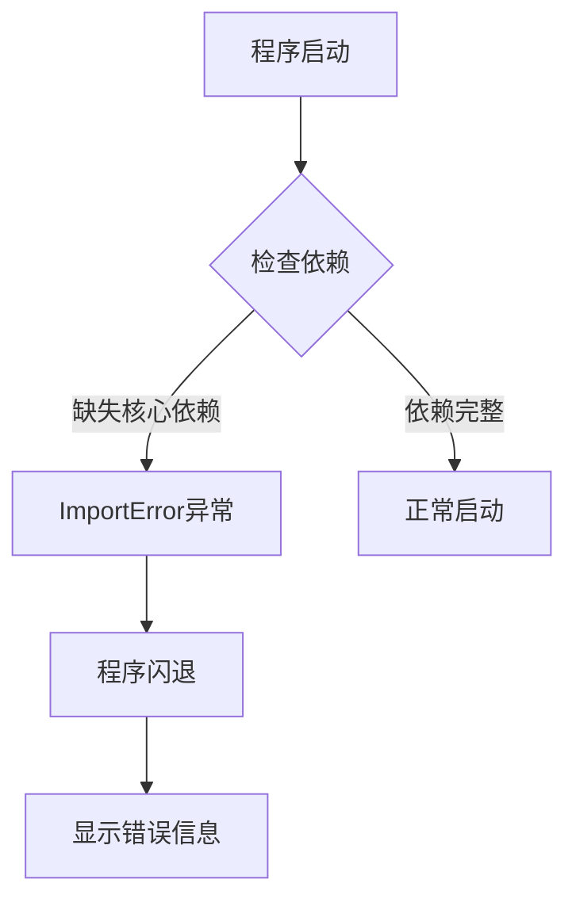
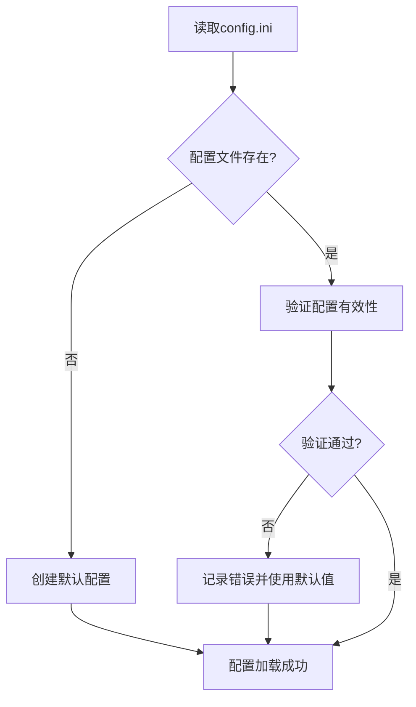
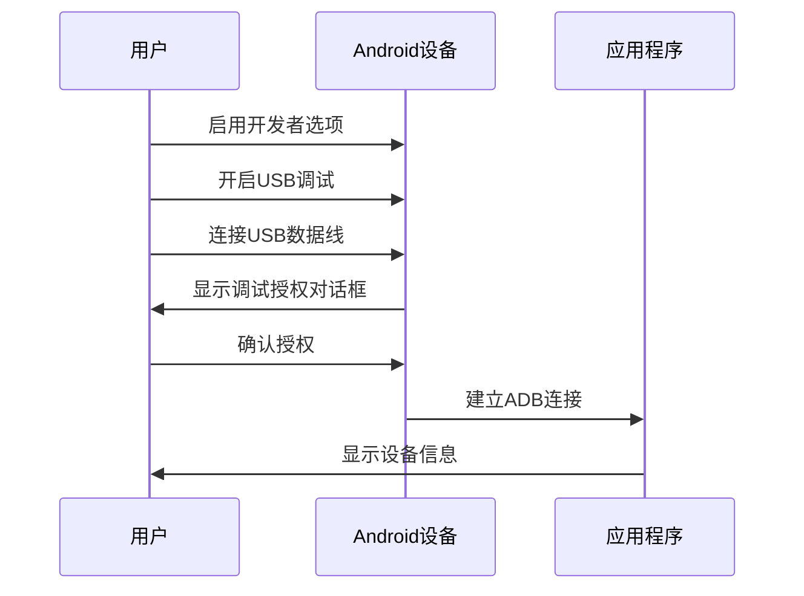
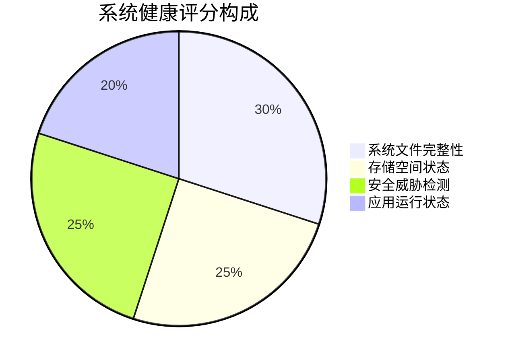
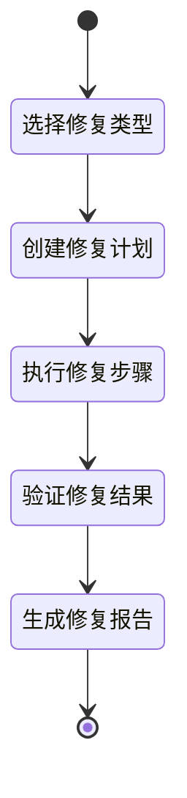

# Android系统修复工具闪退问题修复与使用指南

## 概述

本文档专门解决Android系统修复工具的闪退问题，并提供详细的使用指南。该工具是基于Python和Tkinter开发的桌面应用程序，用于Android设备的系统诊断和修复。

### 项目技术栈
- **开发语言**: Python 3.8+
- **GUI框架**: Tkinter
- **Android通信**: ADB (Android Debug Bridge)
- **安全扫描**: yara-python, pyclamd
- **依赖管理**: requirements.txt

## 闪退问题诊断与修复

### 常见闪退原因分析

#### 1. 依赖缺失导致的闪退



**解决方案**:
- 运行 `python start.py` 进行依赖检查
- 执行 `pip install -r requirements.txt` 安装缺失依赖

#### 2. ADB配置错误导致的闪退

| 错误类型 | 表现症状 | 解决方法 |
|---------|---------|---------|
| ADB路径未找到 | 设备管理器初始化失败 | 设置正确的ADB路径 |
| ADB版本不兼容 | ADB命令执行异常 | 更新到兼容版本 |
| ADB权限不足 | 连接设备失败 | 以管理员权限运行 |

#### 3. GUI组件初始化错误

**MainWindow属性访问错误修复**:
```python
# 确保MainWindow类包含run方法
class MainWindow(LoggerMixin):
    def run(self) -> None:
        """运行主界面"""
        self.logger.info("启动主界面")
        self._set_status("Android系统修复工具已启动")
        self.root.mainloop()
```

#### 4. 配置文件错误导致的闪退

**配置验证机制**:


### 闪退修复策略

#### 1. 启动前检查机制

```python
def check_dependencies():
    """检查依赖项"""
    required_modules = [
        'tkinter', 'requests', 'psutil', 'adb_shell', 'PIL'
    ]
    
    missing_modules = []
    for module in required_modules:
        try:
            __import__(module)
        except ImportError:
            missing_modules.append(module)
    
    return missing_modules
```

#### 2. 异常处理机制

**主程序异常捕获**:
```python
def main():
    try:
        config = AppConfig()
        setup_logger(config.log_level, config.log_file)
        app = MainWindow(config)
        app.run()
    except Exception as e:
        logging.error(f"程序启动失败: {e}", exc_info=True)
        sys.exit(1)
```

**GUI线程异常处理**:
```python
def run_diagnostic():
    try:
        # 诊断逻辑
        pass
    except Exception as e:
        self.root.after(0, lambda: self._append_diagnostic_result(f"诊断异常: {str(e)}"))
        self.logger.error(f"诊断异常: {e}")
```

#### 3. 日志记录系统

**日志配置**:
- 文件滚动: 最大10MB，保留5个备份
- 日志级别: INFO/DEBUG/WARNING/ERROR
- 格式化: `[时间] [级别] [模块] 消息`

### 闪退问题调试指南

#### 1. 查看日志文件
```bash
# 查看应用日志
cat logs/app.log

# 查看最新错误
tail -f logs/app.log | grep ERROR
```

#### 2. 运行测试验证
```bash
# 基础功能测试
python test_basic.py

# 集成测试
python test_integration.py

# MainWindow修复验证
python test_mainwindow_fix.py
```

#### 3. 调试模式启动
```bash
# 启用详细日志
export LOG_LEVEL=DEBUG
python main.py
```

## 使用指南

### 环境准备

#### 1. 系统要求
- **操作系统**: Windows 10/11, Linux, macOS
- **Python版本**: 3.8 或更高
- **内存**: 至少2GB可用内存
- **磁盘空间**: 至少500MB可用空间

#### 2. 依赖安装流程


**详细步骤**:
```bash
# 1. 安装Python依赖
pip install -r requirements.txt

# 2. 验证安装
python start.py

# 3. 检查ADB
adb version
```

#### 3. ADB配置指南

**自动检测ADB路径**:
- 检查PATH环境变量
- 扫描常见安装目录
- 检查ANDROID_HOME环境变量

**手动配置ADB**:
```ini
[adb]
adb_path = C:\Platform-Tools\adb.exe
timeout = 30
port = 5037
```

### 设备连接流程

#### 1. Android设备准备



#### 2. 设备连接步骤
1. **启用开发者选项**: 设置 → 关于手机 → 连续点击"版本号"7次
2. **开启USB调试**: 设置 → 开发者选项 → USB调试
3. **连接设备**: 使用USB数据线连接设备到电脑
4. **授权调试**: 在设备上确认USB调试授权
5. **刷新设备**: 在应用中点击"刷新设备"按钮

#### 3. 连接故障排除

| 问题现象 | 可能原因 | 解决方法 |
|---------|---------|---------|
| 设备未检测到 | USB驱动问题 | 安装设备驱动程序 |
| 授权失败 | 设备锁屏 | 解锁设备并重新授权 |
| 连接不稳定 | 数据线问题 | 更换USB数据线 |
| ADB异常 | ADB进程冲突 | 重启ADB服务 |

### 功能使用指南

#### 1. 系统诊断功能

**诊断选项配置**:
```yaml
扫描项目:
  - 存储空间检查: 检查剩余空间和使用率
  - 系统文件检查: 验证关键系统文件
  - 资源扫描: 检查系统资源完整性
  - 病毒扫描: 检测恶意软件
  - 错误文件检查: 查找损坏文件
```

**诊断报告解读**:


#### 2. 修复操作功能

**修复类型**:
- **一键修复**: 全面的系统修复流程
- **缓存清理**: 清理应用和系统缓存
- **权限修复**: 修复系统权限问题（需要ROOT）
- **病毒清除**: 移除检测到的恶意软件

**修复流程**:


#### 3. 安全扫描功能

**扫描范围**:
- 已安装应用包名检查
- 运行进程安全分析
- 网络连接监控
- 系统文件完整性验证

**威胁级别分类**:
| 级别 | 恶意软件数量 | 处理建议 |
|------|-------------|----------|
| LOW | 0个 | 系统安全，继续监控 |
| MEDIUM | 1-2个 | 建议手动检查 |
| HIGH | 3-4个 | 立即处理威胁 |
| CRITICAL | 5个以上 | 紧急安全响应 |

### 高级功能

#### 1. 实时防护

**监控机制**:
```python
# 每30秒检查一次
监控项目:
  - 新安装应用检测
  - 可疑进程监控
  - 网络连接分析
  - 系统行为监控
```

#### 2. 备份与恢复

**自动备份策略**:
- 修复前自动创建备份
- 保留最近10个备份文件
- 支持配置数据导出

#### 3. 批量设备管理

**企业级功能**:
- 同时管理多个设备
- 批量执行修复任务
- 集中化监控面板

### 最佳实践

#### 1. 使用建议
- 定期进行系统诊断（建议每周一次）
- 在修复前确保设备有足够电量
- 重要修复操作前备份重要数据
- 保持工具和病毒库更新

#### 2. 性能优化
- 关闭不必要的后台应用
- 确保USB连接稳定
- 在设备空闲时执行耗时操作
- 监控工具的资源使用情况

#### 3. 安全注意事项
- 仅在可信任的设备上使用
- 定期更新病毒特征库
- 谨慎处理ROOT权限操作
- 保护设备调试授权密钥

### 故障排除

#### 1. 常见问题解决

**程序无法启动**:
```bash
# 检查Python版本
python --version

# 验证依赖安装
python -c "import tkinter; print('GUI框架正常')"

# 运行诊断脚本
python start.py
```

**设备连接问题**:
```bash
# 检查ADB状态
adb devices

# 重启ADB服务
adb kill-server
adb start-server

# 验证设备授权
adb shell echo "连接成功"
```

**修复功能异常**:
- 检查设备ROOT状态
- 验证剩余存储空间
- 查看修复日志详情
- 重启设备后重试

#### 2. 日志分析指南

**关键错误标识**:
```regex
错误模式:
  - "ImportError": 依赖缺失
  - "AdbTimeoutError": ADB连接超时
  - "PermissionError": 权限不足
  - "ConfigError": 配置文件错误
```

**性能监控指标**:
- 内存使用率不超过500MB
- CPU使用率平均低于30%
- 网络响应时间小于2秒
- 磁盘I/O操作正常

### 版本更新与维护

#### 1. 更新检查
- 启动时自动检查更新
- 支持增量更新机制
- 病毒库自动更新

#### 2. 数据维护
- 定期清理过期日志
- 压缩历史备份文件
- 更新系统资源库

#### 3. 社区支持
- GitHub Issues提交问题
- 用户文档和FAQ
- 社区修复方案分享

通过本指南，用户可以有效解决闪退问题并充分利用Android系统修复工具的各项功能。工具提供了完整的错误处理机制、详细的日志记录和用户友好的界面，确保在各种环境下的稳定运行。