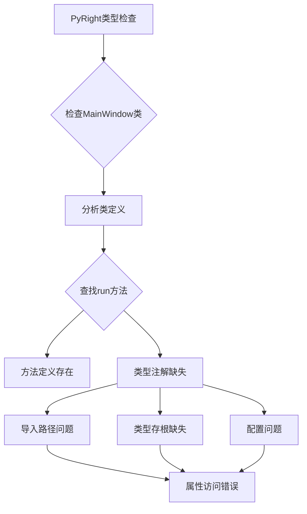
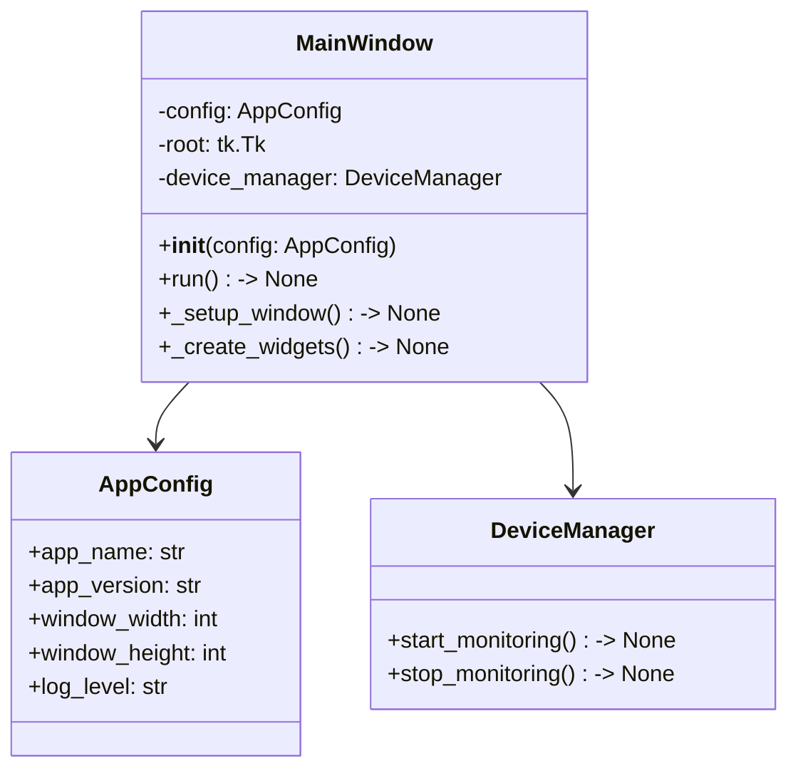
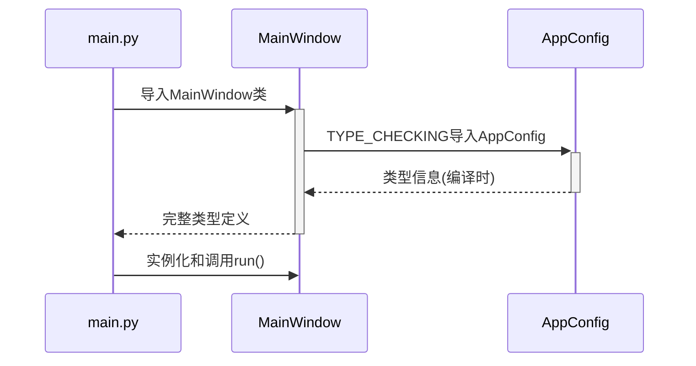
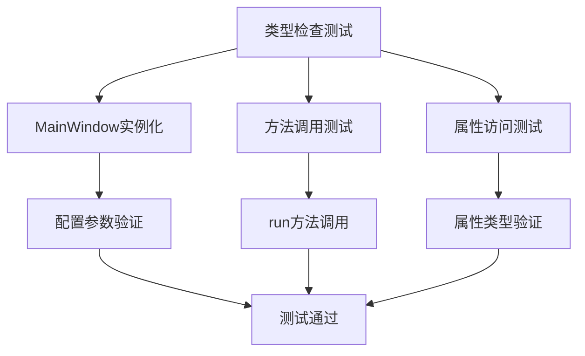
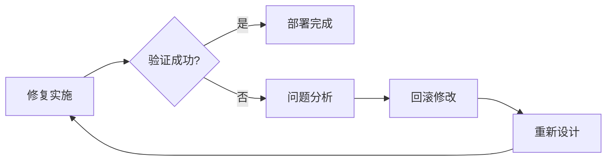

# Android系统修复工具 - 属性访问错误修复设计

## 概述

本设计文档旨在解决Android系统修复工具中出现的属性访问错误问题，特别是`MainWindow`类的`run`属性无法被PyRight静态类型检查器识别的问题。通过分析错误原因并提供解决方案，确保代码的类型安全性和IDE支持。

## 技术栈与依赖

- **编程语言**: Python 3.x
- **GUI框架**: Tkinter (内置)
- **类型检查器**: BasedPyright/PyRight
- **核心依赖**: adb-shell, requests, psutil, yara-python
- **开发工具**: mypy, pytest, black

## 错误分析

### 问题描述

```python
# main.py:39 - 属性访问错误
app = MainWindow(config)
app.run()  # 报错: 无法访问 "MainWindow" 类的 "run" 属性
```

### 错误类型

- **错误代码**: reportAttributeAccessIssue
- **严重程度**: Error (8)
- **位置**: main.py:39:13-16
- **消息**: 属性 "run" 未知

### 根本原因分析



## 解决方案架构

### 1. 类型系统完善架构



### 2. 类型注解补充方案

| 组件 | 当前状态 | 改进方案 | 优先级 |
|------|----------|----------|--------|
| MainWindow类 | 部分注解 | 完整类型注解 | 高 |
| 方法返回值 | 缺失 | 添加返回类型 | 高 |
| 参数类型 | 部分 | 完整参数注解 | 中 |
| 属性类型 | 缺失 | 添加属性注解 | 中 |

### 3. 代码修复策略

#### 策略A: 类型注解完善
```python
from typing import Optional, Any
import tkinter as tk

class MainWindow:
    def __init__(self, config: 'AppConfig') -> None:
        ...
    
    def run(self) -> None:
        """运行主界面 - 启动Tkinter主循环"""
        ...
```

#### 策略B: 导入优化
```python
# 使用TYPE_CHECKING避免循环导入
from typing import TYPE_CHECKING
if TYPE_CHECKING:
    from ..config.settings import AppConfig
```

#### 策略C: PyRight配置优化
```json
{
    "python.analysis.typeCheckingMode": "basic",
    "python.analysis.autoImportCompletions": true,
    "python.analysis.indexing": true
}
```

## 实现方案

### 第一阶段: 类型注解修复

#### MainWindow类型定义优化


**修改清单:**

1. **导入类型模块**
   - 添加`from typing import Optional, Any`
   - 添加条件类型导入

2. **方法类型注解**
   - `__init__`方法参数和返回值
   - `run`方法返回值注解
   - 所有公共方法类型声明

3. **属性类型声明**
   - 实例属性类型注解
   - 类变量类型声明

### 第二阶段: 导入路径优化

#### 循环导入解决方案



### 第三阶段: 开发工具配置

#### PyRight配置优化表

| 配置项 | 当前值 | 推荐值 | 作用 |
|--------|--------|--------|------|
| typeCheckingMode | off | basic | 启用基础类型检查 |
| reportMissingImports | false | true | 检查缺失导入 |
| reportMissingTypeStubs | false | true | 检查类型存根 |
| pythonPath | auto | 显式设置 | 确保路径正确 |

## 测试验证

### 单元测试架构



### 测试用例设计

#### 类型检查验证测试
```python
def test_mainwindow_type_annotations():
    """验证MainWindow类型注解完整性"""
    # 检查类定义
    # 验证方法签名
    # 确认返回类型
```

#### 属性访问测试
```python
def test_mainwindow_run_method():
    """验证run方法可访问性"""
    # 实例化MainWindow
    # 调用run方法
    # 验证无异常
```

### 集成测试策略

| 测试类型 | 测试范围 | 验证内容 |
|----------|----------|----------|
| 静态检查 | 全部Python文件 | 类型注解正确性 |
| 动态测试 | MainWindow类 | 方法调用成功 |
| 回归测试 | 主要功能 | 修复无破坏性 |

## 风险评估与缓解

### 风险矩阵

| 风险项目 | 概率 | 影响 | 级别 | 缓解措施 |
|----------|------|------|------|----------|
| 类型注解错误 | 中 | 高 | 中 | 增量测试验证 |
| 导入循环依赖 | 低 | 高 | 中 | TYPE_CHECKING使用 |
| 性能影响 | 低 | 低 | 低 | 性能基准测试 |
| 兼容性问题 | 低 | 中 | 低 | 多版本测试 |

### 回滚策略



## 实施计划

### 时间线规划

| 阶段 | 任务 | 时间 | 负责人 |
|------|------|------|--------|
| 阶段1 | 类型注解修复 | 2小时 | 开发者 |
| 阶段2 | 导入优化 | 1小时 | 开发者 |
| 阶段3 | 配置调整 | 0.5小时 | 开发者 |
| 阶段4 | 测试验证 | 1小时 | 开发者 |

### 验收标准

- [ ] PyRight不再报告属性访问错误
- [ ] MainWindow.run()方法正常调用
- [ ] 所有单元测试通过
- [ ] 类型检查工具无警告
- [ ] 应用程序正常启动运行

## 维护指南

### 代码质量保障

1. **类型注解规范**
   - 所有公共方法必须有完整类型注解
   - 复杂类型使用Union和Optional
   - 避免使用Any类型

2. **导入管理**
   - 使用TYPE_CHECKING避免循环导入
   - 保持导入顺序一致性
   - 定期检查未使用导入

3. **工具配置维护**
   - 定期更新PyRight配置
   - 保持类型检查严格性
   - 监控新版本兼容性

### 后续优化建议

- 考虑使用Protocol定义接口类型
- 引入泛型类型提升类型安全
- 建立类型检查CI/CD流水线
- 完善整体项目类型覆盖率