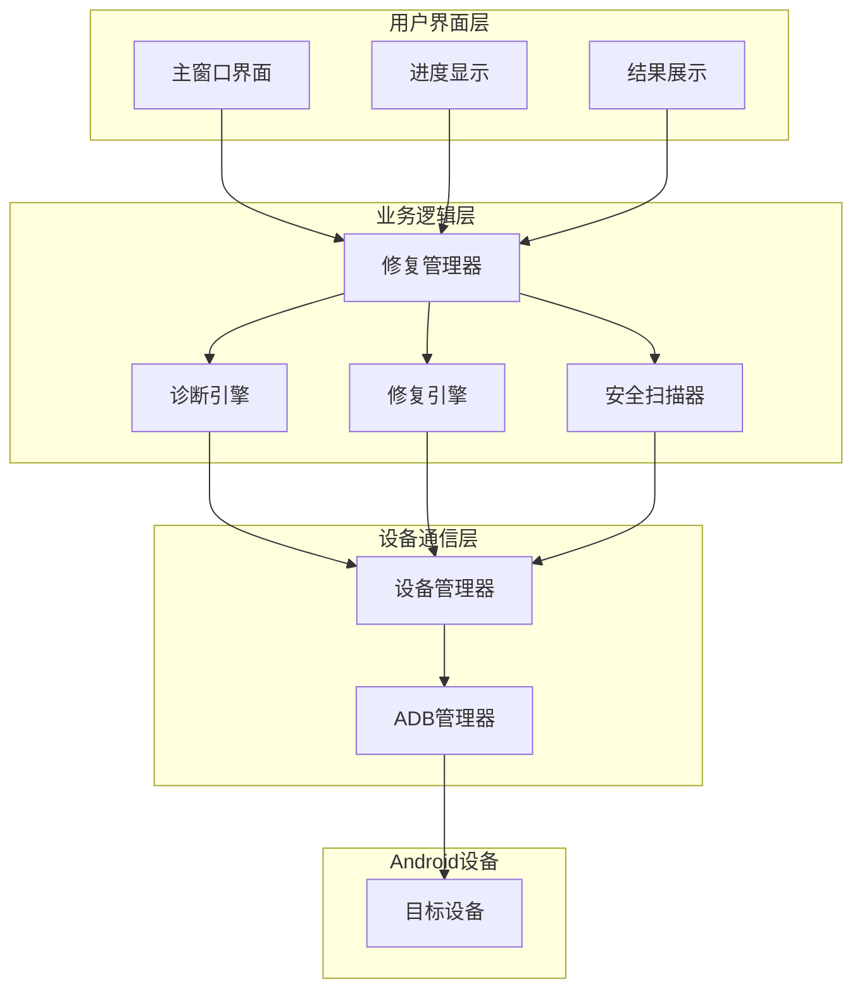
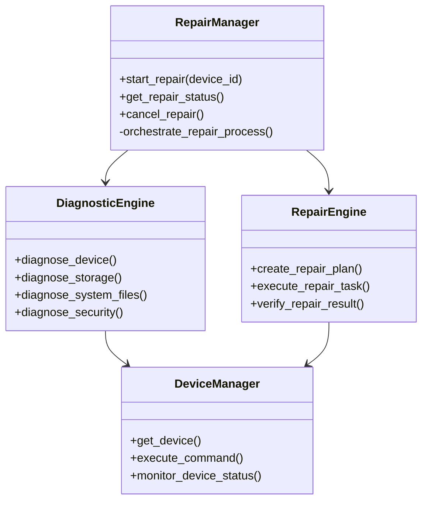
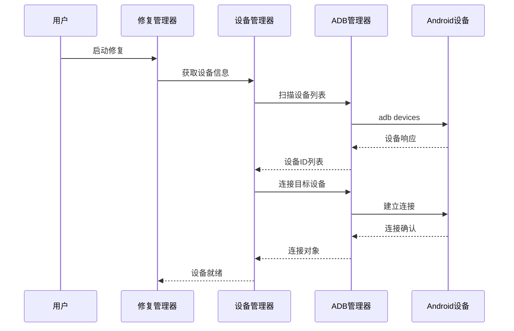
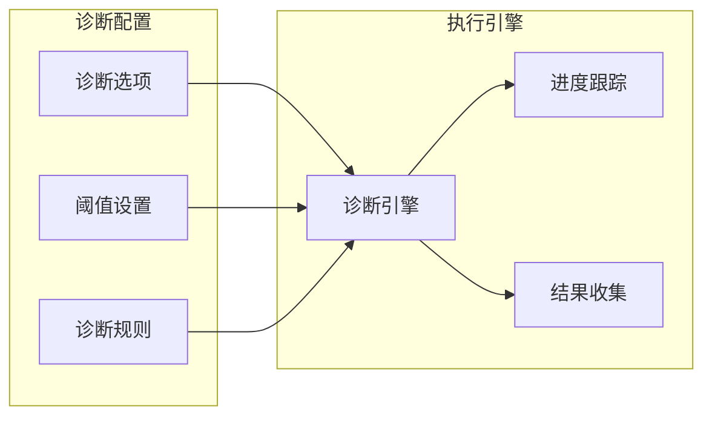
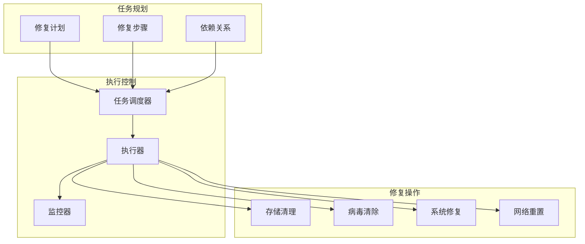
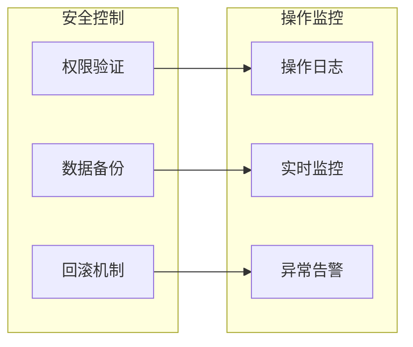
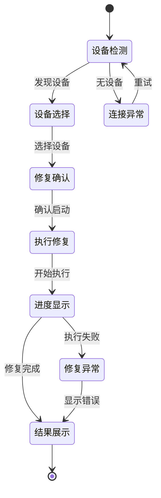
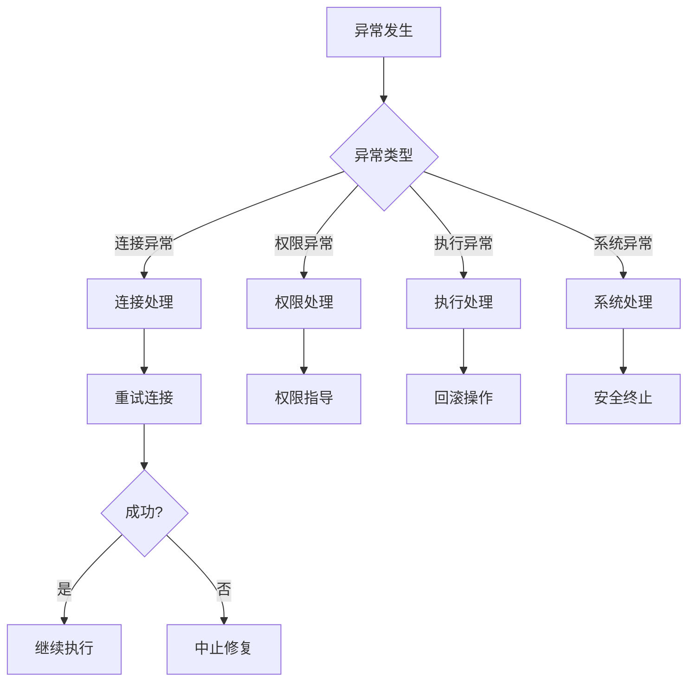
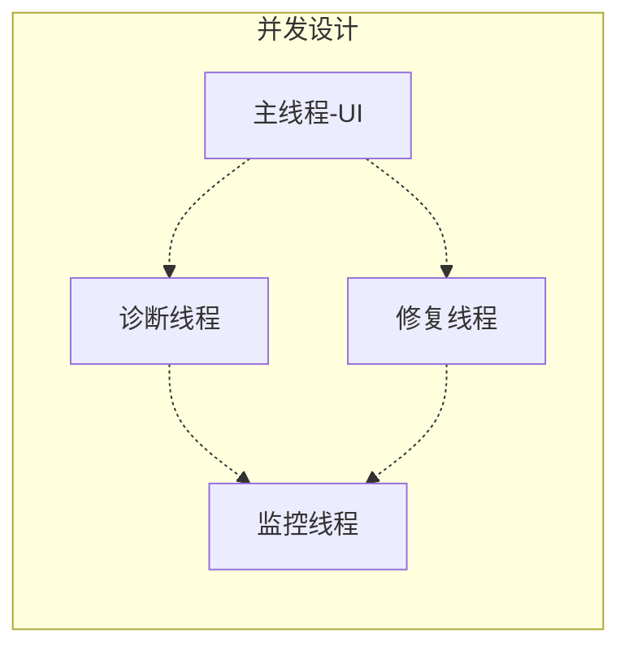
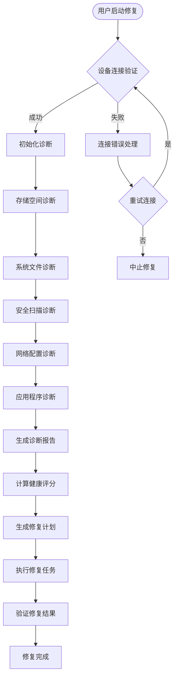

# 设备连接修复功能设计文档

## 概述

设备连接修复功能是Android系统修复工具的核心模块，旨在为已连接的Android设备提供自动化的系统诊断和修复服务。该功能通过ADB通信协议，对设备进行全方位的健康检查，并自动执行修复操作以解决常见的系统问题。

### 核心价值
- **自动化修复**：一键启动完整的设备诊断和修复流程
- **多维度检查**：覆盖存储、系统文件、安全、网络等多个方面
- **智能评估**：基于诊断结果生成健康评分和修复建议
- **安全可靠**：确保修复过程不会损坏设备数据

## 技术架构

### 系统架构图



### 核心组件关系



## 修复流程设计

### 主要修复流程


### 诊断子流程

| 诊断项目 | 检查内容 | 严重级别判定 | 修复策略 |
|---------|----------|-------------|----------|
| 存储空间 | 可用空间百分比 | >95%为严重，>85%为警告 | 清理缓存、临时文件 |
| 系统文件 | 关键文件完整性 | 缺失核心文件为严重 | 恢复系统资源 |
| 安全检查 | 恶意软件扫描 | 发现病毒为严重 | 隔离清除恶意软件 |
| 网络配置 | 连接状态检查 | 无法联网为中等 | 重置网络配置 |
| 应用程序 | 应用状态检查 | 大量崩溃为中等 | 清理应用数据 |

## 设备连接管理

### ADB连接架构



### 连接故障处理

| 错误类型 | 识别方法 | 处理策略 |
|---------|----------|----------|
| 设备未授权 | unauthorized状态 | 引导用户确认授权弹窗 |
| ADB服务异常 | 命令执行失败 | 重启ADB服务 |
| USB连接中断 | 设备列表为空 | 检查USB连接，重新扫描 |
| 权限不足 | 命令返回权限错误 | 提示用户检查开发者选项 |

## 诊断引擎设计

### 诊断策略配置



### 问题分类体系

| 问题类别 | 检查方法 | 严重性评估 | 自动修复能力 |
|---------|----------|------------|-------------|
| 存储问题 | df命令获取磁盘使用率 | 基于使用百分比 | 支持 |
| 系统文件 | 文件存在性检查 | 关键文件缺失为严重 | 部分支持 |
| 安全威胁 | 病毒特征匹配 | 发现威胁为严重 | 支持 |
| 网络连接 | ping连通性测试 | 无法联网为中等 | 支持 |
| 应用异常 | 应用状态查询 | 崩溃率高为中等 | 支持 |

## 修复引擎设计

### 修复任务调度



### 修复模板设计

| 修复类型 | 包含步骤 | 预计时长 | 依赖关系 |
|---------|----------|----------|----------|
| 存储清理 | 缓存清理→临时文件清理→日志清理 | 2分钟 | 顺序执行 |
| 病毒清除 | 病毒扫描→恶意软件清除→安全检查 | 5分钟 | 顺序执行 |
| 全面修复 | 数据备份→病毒扫描→文件清理→权限修复→系统优化 | 15分钟 | 严格依赖 |

## 安全与权限控制

### 安全机制设计



### 权限要求

| 操作类型 | 所需权限 | 风险级别 | 安全措施 |
|---------|----------|----------|----------|
| 文件清理 | 普通权限 | 低 | 操作确认 |
| 应用管理 | 设备管理员 | 中 | 操作日志 |
| 系统修复 | Root权限 | 高 | 数据备份 |
| 网络配置 | 网络权限 | 中 | 配置备份 |

## 用户体验设计

### 界面交互流程



### 进度反馈机制

| 阶段 | 进度范围 | 显示内容 | 预计时长 |
|------|----------|----------|----------|
| 初始化 | 0-10% | 连接设备，初始化环境 | 10秒 |
| 诊断阶段 | 10-60% | 各项系统检查 | 2分钟 |
| 修复规划 | 60-70% | 分析问题，制定修复计划 | 20秒 |
| 修复执行 | 70-95% | 执行修复操作 | 5-15分钟 |
| 完成验证 | 95-100% | 验证修复结果 | 30秒 |

## 异常处理策略

### 异常分类处理



### 错误恢复机制

| 异常类型 | 检测方法 | 恢复策略 | 用户提示 |
|---------|----------|----------|----------|
| 设备断连 | 命令执行超时 | 重新连接 | "设备连接中断，正在重连..." |
| 权限被拒 | 命令返回权限错误 | 跳过该步骤 | "权限不足，已跳过该项修复" |
| 修复失败 | 操作返回错误 | 回滚更改 | "修复操作失败，已回滚更改" |
| 系统异常 | 未捕获异常 | 安全退出 | "系统异常，请重新启动修复" |

## 性能优化

### 并发处理策略



### 资源使用优化

| 资源类型 | 优化策略 | 监控指标 | 限制措施 |
|---------|----------|----------|----------|
| 内存使用 | 及时释放大对象 | 内存使用率 | 超过80%时警告 |
| CPU占用 | 异步执行耗时操作 | CPU使用率 | 限制并发线程数 |
| 网络带宽 | 压缩传输数据 | 传输速率 | 分批传输大文件 |
| 设备负载 | 控制ADB命令频率 | 响应时间 | 命令间隔限制 |

## 测试策略

### 测试覆盖矩阵

| 测试类型 | 测试范围 | 测试方法 | 成功标准 |
|---------|----------|----------|----------|
| 单元测试 | 核心组件功能 | 自动化测试 | 代码覆盖率>90% |
| 集成测试 | 组件间交互 | 模拟设备测试 | 所有接口正常 |
| 设备测试 | 真实设备修复 | 多设备型号测试 | 修复成功率>95% |
| 压力测试 | 高负载场景 | 长时间运行测试 | 系统稳定运行 |

### 测试用例设计

```mermaid
graph TB
    subgraph "功能测试"
        Basic[基础功能测试]
        Scenario[场景测试]
        Edge[边界测试]
    end
    
    subgraph "集成测试"
        Device[设备集成测试]
        System[系统集成测试]
        End2End[端到端测试]
    end
    
    Basic --> Device
    Scenario --> System
    Edge --> End2End
```        RM[修复管理器]
        DE[诊断引擎]
        RE[修复引擎]
        SS[安全扫描器]
    end
    
    subgraph "设备通信层"
        DM[设备管理器]
        ADB[ADB管理器]
    end
    
    subgraph "Android设备"
        Device[目标设备]
    end
    
    UI --> RM
    Progress --> RM
    Results --> RM
    
    RM --> DE
    RM --> RE
    RM --> SS
    
    DE --> DM
    RE --> DM
    SS --> DM
    
    DM --> ADB
    ADB --> Device
```

### 核心组件关系


## 修复流程设计

### 主要修复流程



### 诊断子流程

| 诊断项目 | 检查内容 | 严重级别判定 | 修复策略 |
|---------|----------|-------------|----------|
| 存储空间 | 可用空间百分比 | >95%为严重，>85%为警告 | 清理缓存、临时文件 |
| 系统文件 | 关键文件完整性 | 缺失核心文件为严重 | 恢复系统资源 |
| 安全检查 | 恶意软件扫描 | 发现病毒为严重 | 隔离清除恶意软件 |
| 网络配置 | 连接状态检查 | 无法联网为中等 | 重置网络配置 |
| 应用程序 | 应用状态检查 | 大量崩溃为中等 | 清理应用数据 |

## 设备连接管理

### ADB连接架构


### 连接故障处理

| 错误类型 | 识别方法 | 处理策略 |
|---------|----------|----------|
| 设备未授权 | unauthorized状态 | 引导用户确认授权弹窗 |
| ADB服务异常 | 命令执行失败 | 重启ADB服务 |
| USB连接中断 | 设备列表为空 | 检查USB连接，重新扫描 |
| 权限不足 | 命令返回权限错误 | 提示用户检查开发者选项 |

## 诊断引擎设计

### 诊断策略配置


### 问题分类体系

| 问题类别 | 检查方法 | 严重性评估 | 自动修复能力 |
|---------|----------|------------|-------------|
| 存储问题 | df命令获取磁盘使用率 | 基于使用百分比 | 支持 |
| 系统文件 | 文件存在性检查 | 关键文件缺失为严重 | 部分支持 |
| 安全威胁 | 病毒特征匹配 | 发现威胁为严重 | 支持 |
| 网络连接 | ping连通性测试 | 无法联网为中等 | 支持 |
| 应用异常 | 应用状态查询 | 崩溃率高为中等 | 支持 |

## 修复引擎设计

### 修复任务调度


### 修复模板设计

| 修复类型 | 包含步骤 | 预计时长 | 依赖关系 |
|---------|----------|----------|----------|
| 存储清理 | 缓存清理→临时文件清理→日志清理 | 2分钟 | 顺序执行 |
| 病毒清除 | 病毒扫描→恶意软件清除→安全检查 | 5分钟 | 顺序执行 |
| 全面修复 | 数据备份→病毒扫描→文件清理→权限修复→系统优化 | 15分钟 | 严格依赖 |

## 安全与权限控制

### 安全机制设计


### 权限要求

| 操作类型 | 所需权限 | 风险级别 | 安全措施 |
|---------|----------|----------|----------|
| 文件清理 | 普通权限 | 低 | 操作确认 |
| 应用管理 | 设备管理员 | 中 | 操作日志 |
| 系统修复 | Root权限 | 高 | 数据备份 |
| 网络配置 | 网络权限 | 中 | 配置备份 |

## 用户体验设计

### 界面交互流程


### 进度反馈机制

| 阶段 | 进度范围 | 显示内容 | 预计时长 |
|------|----------|----------|----------|
| 初始化 | 0-10% | 连接设备，初始化环境 | 10秒 |
| 诊断阶段 | 10-60% | 各项系统检查 | 2分钟 |
| 修复规划 | 60-70% | 分析问题，制定修复计划 | 20秒 |
| 修复执行 | 70-95% | 执行修复操作 | 5-15分钟 |
| 完成验证 | 95-100% | 验证修复结果 | 30秒 |

## 异常处理策略

### 异常分类处理


### 错误恢复机制

| 异常类型 | 检测方法 | 恢复策略 | 用户提示 |
|---------|----------|----------|----------|
| 设备断连 | 命令执行超时 | 重新连接 | "设备连接中断，正在重连..." |
| 权限被拒 | 命令返回权限错误 | 跳过该步骤 | "权限不足，已跳过该项修复" |
| 修复失败 | 操作返回错误 | 回滚更改 | "修复操作失败，已回滚更改" |
| 系统异常 | 未捕获异常 | 安全退出 | "系统异常，请重新启动修复" |

## 性能优化

### 并发处理策略


### 资源使用优化

| 资源类型 | 优化策略 | 监控指标 | 限制措施 |
|---------|----------|----------|----------|
| 内存使用 | 及时释放大对象 | 内存使用率 | 超过80%时警告 |
| CPU占用 | 异步执行耗时操作 | CPU使用率 | 限制并发线程数 |
| 网络带宽 | 压缩传输数据 | 传输速率 | 分批传输大文件 |
| 设备负载 | 控制ADB命令频率 | 响应时间 | 命令间隔限制 |

## 测试策略

### 测试覆盖矩阵

| 测试类型 | 测试范围 | 测试方法 | 成功标准 |
|---------|----------|----------|----------|
| 单元测试 | 核心组件功能 | 自动化测试 | 代码覆盖率>90% |
| 集成测试 | 组件间交互 | 模拟设备测试 | 所有接口正常 |
| 设备测试 | 真实设备修复 | 多设备型号测试 | 修复成功率>95% |
| 压力测试 | 高负载场景 | 长时间运行测试 | 系统稳定运行 |

### 测试用例设计

```mermaid
graph TB
    subgraph "功能测试"
        Basic[基础功能测试]
        Scenario[场景测试]
        Edge[边界测试]
    end
    
    subgraph "集成测试"
        Device[设备集成测试]
        System[系统集成测试]
        End2End[端到端测试]
    end
    
    Basic --> Device
    Scenario --> System
    Edge --> End2End
```


