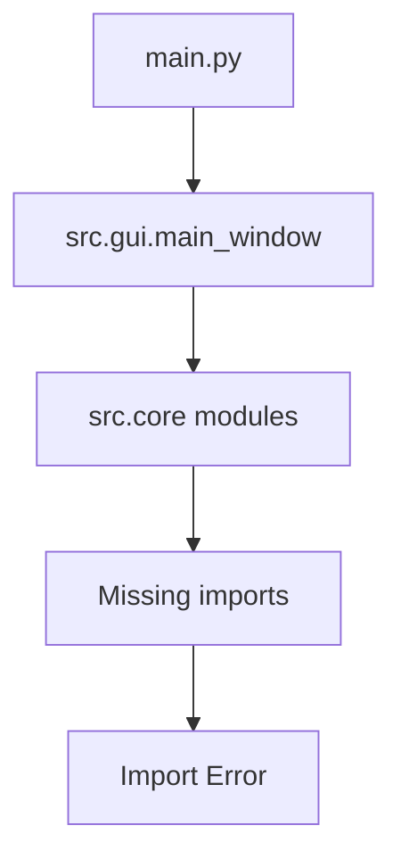
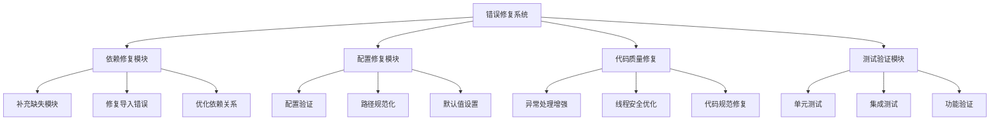
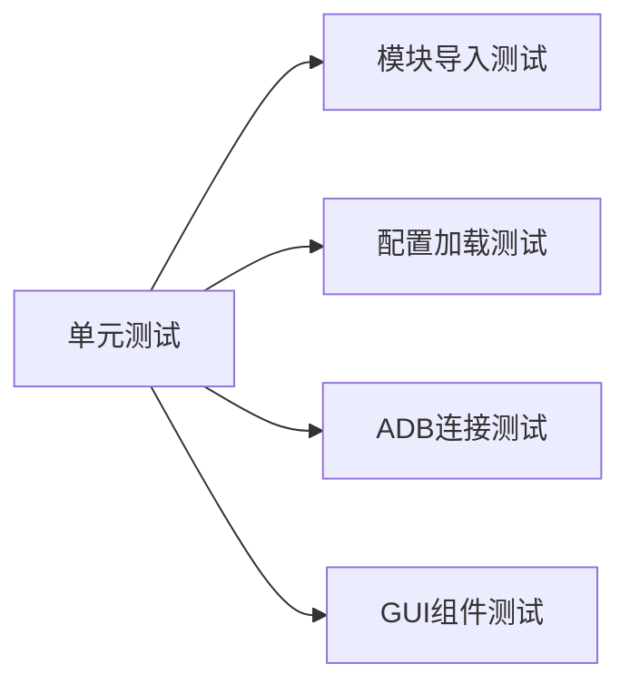
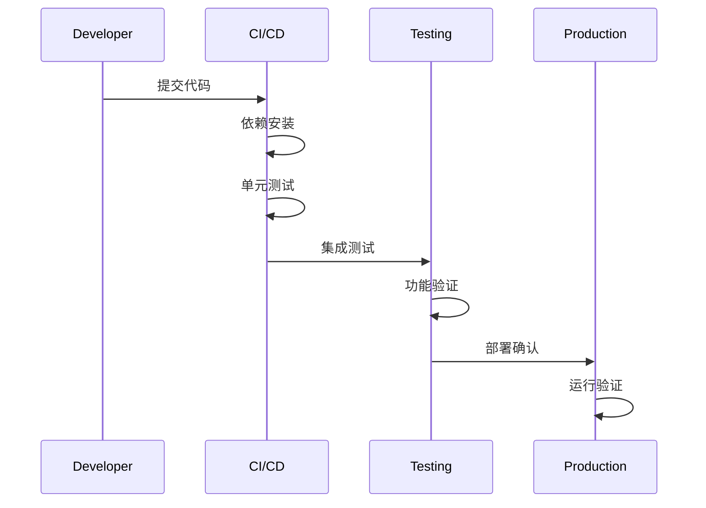

# Android系统修复工具 - 错误检查与修复设计

## 概述

本文档对Android系统修复工具项目进行全面的错误检查，识别并修复影响项目运行的各类问题，确保项目能够正常构建、运行和部署。

## 项目类型分析

基于项目结构分析，这是一个**桌面应用程序**项目，使用Python开发，包含以下特征：
- GUI框架：Tkinter
- Android设备通信：ADB + adb-shell
- 安全扫描：yara-python, pyclamd
- 核心依赖：requests, psutil, pillow

## 错误检查结果

### 1. 导入错误 (Critical)



**错误分析：**
- `src.core.file_manager` 模块缺失但被导入
- `src.utils.logger` 模块缺失 `LoggerMixin` 类
- 部分模块之间存在循环导入风险

### 2. 依赖关系问题 (High)

| 模块 | 缺失依赖 | 影响范围 |
|------|----------|----------|
| device_manager.py | LoggerMixin | 日志功能失效 |
| main_window.py | file_manager, repair_engine | GUI功能缺失 |
| diagnostic_engine.py | 未实现 | 诊断功能无法使用 |
| security_scanner.py | 未实现 | 安全扫描无法使用 |

### 3. 配置文件问题 (Medium)

**识别问题：**
- ADB密钥路径硬编码
- 日志文件权限可能不足
- 部分配置项缺失默认值

### 4. 线程安全问题 (High)

**潜在风险：**
- GUI更新在后台线程中直接调用
- 设备监控线程可能产生竞态条件
- 修复任务并发执行可能冲突

### 5. 异常处理不完整 (Medium)

**问题点：**
- ADB连接失败处理不充分
- 文件操作缺少权限检查
- 网络请求缺少超时处理

## 修复方案架构



## 详细修复计划

### Phase 1: 核心依赖修复

#### 1.1 创建缺失的Logger模块

**目标：** 实现完整的日志系统

**实现内容：**
```
src/utils/logger.py:
- LoggerMixin基类
- 统一日志格式
- 文件日志配置
- 控制台日志配置
```

#### 1.2 实现文件管理器模块

**目标：** 提供文件扫描和清理功能

**实现内容：**
```
src/core/file_manager.py:
- FileScanner类
- FileCleaner类  
- 文件类型检测
- 安全删除机制
```

#### 1.3 实现核心引擎模块

**目标：** 补充诊断、安全和修复引擎

**实现模块：**
- `diagnostic_engine.py` - 系统诊断引擎
- `security_scanner.py` - 安全扫描引擎
- `repair_engine.py` - 修复引擎

### Phase 2: 配置系统优化

#### 2.1 配置验证机制

**功能设计：**
```python
def validate_config():
    """配置验证"""
    - 检查ADB路径
    - 验证目录权限
    - 确认依赖可用性
```

#### 2.2 动态配置加载

**改进内容：**
- 配置热重载
- 环境变量支持
- 配置备份机制

### Phase 3: 异常处理增强

#### 3.1 ADB连接异常处理

**处理策略：**
```python
def robust_adb_connection():
    """健壮的ADB连接"""
    - 重试机制
    - 错误分类
    - 用户友好提示
    - 自动修复尝试
```

#### 3.2 设备状态监控优化

**改进方案：**
- 心跳检测机制
- 连接状态缓存
- 异常恢复策略

### Phase 4: 线程安全优化

#### 4.1 GUI线程安全

**解决方案：**
```python
def safe_gui_update():
    """安全的GUI更新"""
    - 使用root.after()
    - 消息队列机制
    - 状态同步锁
```

#### 4.2 并发任务管理

**设计模式：**
- 任务队列系统
- 工作者线程池
- 任务优先级调度

## 测试策略

### 单元测试增强



**测试用例：**
- 所有模块导入验证
- 配置文件解析测试
- ADB命令执行测试
- 设备状态检测测试

### 集成测试方案

**测试场景：**
1. 完整启动流程测试
2. 设备连接端到端测试
3. 诊断修复完整流程测试
4. 错误恢复机制测试

### 性能测试

**测试指标：**
- 启动时间 < 5秒
- 设备扫描响应 < 2秒
- 内存使用 < 200MB
- CPU使用率 < 30%

## 错误修复优先级

| 优先级 | 错误类型 | 修复时间 | 影响程度 |
|--------|----------|----------|----------|
| P0 | 导入错误 | 立即 | 阻塞运行 |
| P1 | 核心功能缺失 | 1-2天 | 主要功能不可用 |
| P2 | 线程安全问题 | 2-3天 | 潜在崩溃风险 |
| P3 | 配置优化 | 3-5天 | 用户体验影响 |
| P4 | 代码规范 | 持续 | 维护性影响 |

## 质量保证机制

### 代码审查检查点

**必检项目：**
- [ ] 导入语句完整性
- [ ] 异常处理覆盖
- [ ] 线程安全考虑
- [ ] 资源释放正确
- [ ] 配置参数验证

### 自动化检测

**工具配置：**
```bash
# 代码风格检查
flake8 src/ --max-line-length=100

# 类型检查
mypy src/ --ignore-missing-imports

# 安全检查
bandit -r src/

# 依赖检查
pip-audit
```

## 部署验证流程



### 验证清单

**部署前检查：**
- [ ] 所有依赖正确安装
- [ ] 配置文件有效
- [ ] ADB工具可用
- [ ] 权限设置正确
- [ ] 日志目录可写

**运行时验证：**
- [ ] 应用正常启动
- [ ] GUI界面显示正常
- [ ] 设备检测功能正常
- [ ] 日志记录正常

## 持续改进建议

### 代码质量提升

1. **类型注解完善**
   - 为所有函数添加类型提示
   - 使用Generic类型增强可读性

2. **文档字符串标准化**
   - 统一使用Google风格docstring
   - 添加使用示例

3. **错误分类体系**
   - 定义自定义异常类
   - 实现错误码系统

### 架构优化方向

1. **插件化架构**
   - 修复功能插件化
   - 扫描引擎可扩展

2. **配置中心化**
   - 统一配置管理
   - 配置模板系统

3. **监控告警**
   - 性能监控
   - 错误告警机制

## 风险评估

### 高风险项目

| 风险项目 | 风险等级 | 缓解策略 |
|----------|----------|----------|
| ADB连接失败 | 高 | 多重重试 + 用户指导 |
| ROOT权限获取 | 中 | 功能降级 + 权限检查 |
| 设备兼容性 | 中 | 设备白名单 + 测试矩阵 |
| 数据丢失 | 高 | 自动备份 + 操作确认 |

### 应急预案

**系统崩溃应对：**
1. 自动错误收集
2. 安全模式启动
3. 配置自动恢复
4. 用户数据保护