# Android系统修复工具 - 闪退问题解决和使用指南设计文档

## 概述

Android系统修复工具是一个基于Python和Tkinter的桌面应用程序，为Android设备提供全方位的系统维护解决方案。本设计文档专注于解决应用闪退问题和提供完整的用户使用指南。

### 项目背景
- **项目类型**: 桌面应用程序
- **主要功能**: Android设备诊断、修复、安全扫描
- **技术栈**: Python 3.8+, Tkinter, ADB, yara-python
- **目标用户**: Android设备维护人员、技术支持工程师

## 架构概览

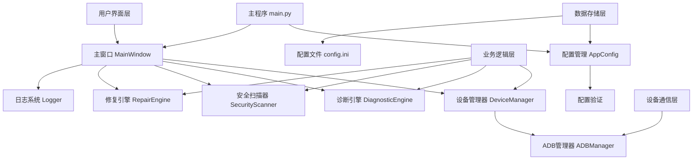

## 闪退问题诊断架构

### 闪退检测机制

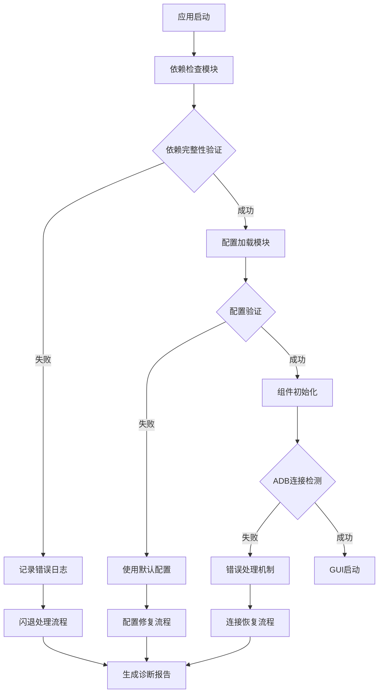

### 错误处理层级结构

| 层级 | 组件 | 错误类型 | 处理策略 |
|------|------|----------|----------|
| 应用层 | MainWindow | GUI异常 | 友好提示 + 日志记录 |
| 业务层 | 各Engine模块 | 逻辑错误 | 状态回滚 + 重试机制 |
| 通信层 | DeviceManager | ADB连接异常 | 自动重连 + 超时处理 |
| 配置层 | AppConfig | 配置错误 | 默认配置 + 验证修复 |

## 闪退问题解决方案

### 1. 依赖检查机制

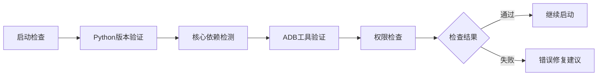

#### 依赖验证项目

| 检查项目 | 验证内容 | 失败处理 |
|----------|----------|----------|
| Python版本 | >= 3.8 | 版本升级提示 |
| 核心依赖 | requirements.txt中的包 | 自动安装引导 |
| ADB工具 | adb命令可用性 | 安装路径配置 |
| 文件权限 | 配置文件读写权限 | 权限修复指南 |
| 网络连接 | 可选的在线服务 | 离线模式切换 |

### 2. 配置验证与修复

#### 配置验证流程

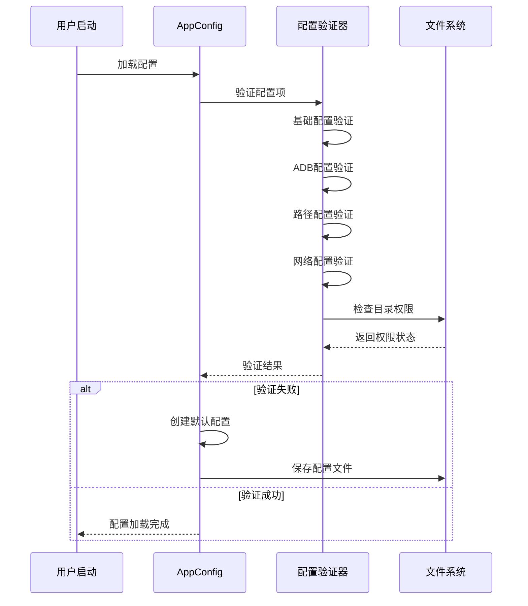

#### 配置项验证规则

| 配置分组 | 验证规则 | 默认值 | 修复策略 |
|----------|----------|--------|----------|
| ADB配置 | 超时时间 > 0, 端口范围 | timeout=30, port=5037 | 重置为安全值 |
| 路径配置 | 路径存在且可写 | logs/, data/, backups/ | 自动创建目录 |
| 网络配置 | 超时时间合理范围 | timeout=10, retry=3 | 使用保守设置 |
| UI配置 | 窗口尺寸合理性 | 1000x700 | 适配屏幕尺寸 |

### 3. 异常捕获与恢复

#### 异常处理架构

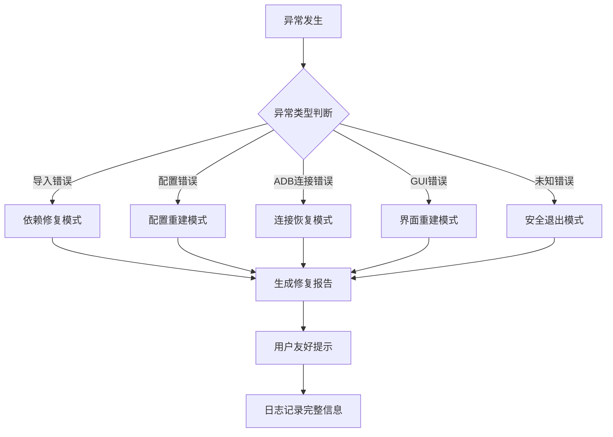

#### 异常恢复策略

| 异常类型 | 检测方式 | 恢复策略 | 用户提示 |
|----------|----------|----------|----------|
| 模块导入失败 | ImportError捕获 | 依赖安装指导 | "缺少必要组件，请安装依赖" |
| ADB连接异常 | 连接超时检测 | 自动重试3次 | "设备连接失败，请检查USB连接" |
| 配置文件损坏 | 配置解析异常 | 重建默认配置 | "配置文件已重置为默认设置" |
| GUI组件错误 | Tkinter异常 | 重建受影响组件 | "界面已恢复，请重试操作" |
| 磁盘空间不足 | OSError处理 | 清理临时文件 | "磁盘空间不足，已清理缓存" |

## 使用指南设计

### 1. 用户引导流程

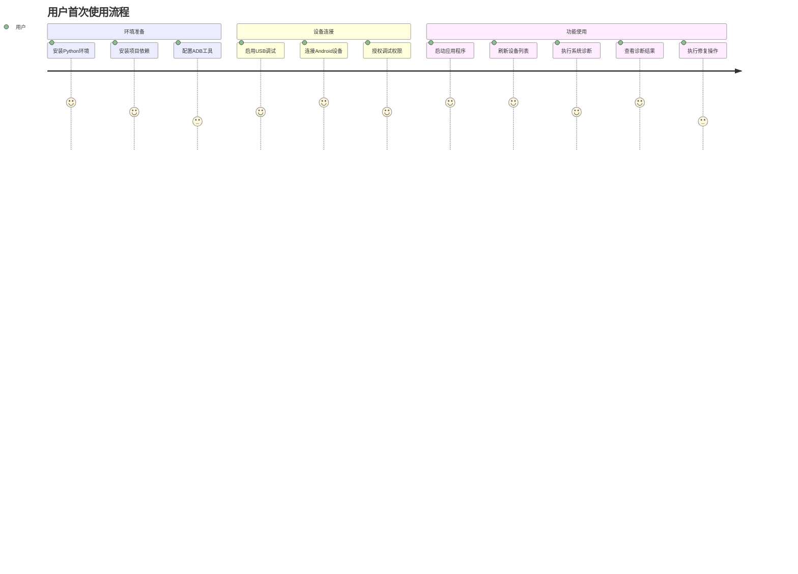

### 2. 功能模块使用指南

#### 设备管理模块

| 操作步骤 | 用户操作 | 系统响应 | 故障处理 |
|----------|----------|----------|----------|
| 1. 设备检测 | 点击"刷新设备" | 扫描USB连接的设备 | 检查USB连接和驱动 |
| 2. 设备连接 | 选择设备并连接 | 建立ADB通信 | 验证USB调试权限 |
| 3. 设备信息 | 查看设备详情 | 显示系统信息 | 检查设备授权状态 |
| 4. 连接断开 | 点击"断开设备" | 释放ADB连接 | 强制断开异常连接 |

#### 系统诊断模块

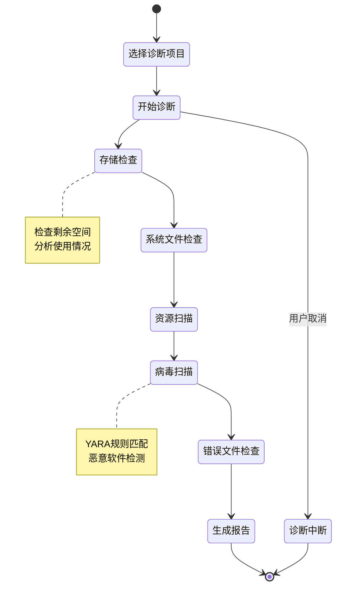

#### 修复操作模块

| 修复类型 | 触发条件 | 执行流程 | 风险等级 |
|----------|----------|----------|----------|
| 一键修复 | 诊断发现问题 | 自动化修复序列 | 低 |
| 缓存清理 | 存储空间不足 | 清理临时文件和缓存 | 低 |
| 权限修复 | 权限异常检测 | 恢复系统文件权限 | 中 |
| 病毒清除 | 检测到恶意软件 | 隔离和删除恶意文件 | 高 |
| 资源修复 | 系统文件损坏 | 从资源库恢复文件 | 高 |

### 3. 故障排除指南

#### 常见问题解决方案

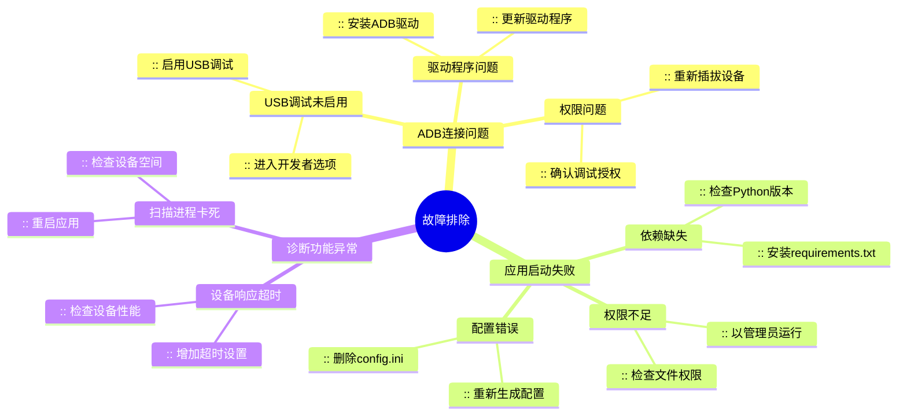

#### 错误代码参考

| 错误代码 | 错误描述 | 可能原因 | 解决方案 |
|----------|----------|----------|----------|
| ERR_001 | ADB连接超时 | 设备未响应或USB问题 | 重新连接设备，检查USB线缆 |
| ERR_002 | 配置文件损坏 | 配置文件格式错误 | 删除config.ini，重新启动应用 |
| ERR_003 | 依赖模块缺失 | Python包未安装 | 执行pip install -r requirements.txt |
| ERR_004 | 权限不足 | 文件系统权限限制 | 以管理员权限运行应用 |
| ERR_005 | 设备授权失败 | USB调试权限未授予 | 在设备上确认调试授权 |

## 测试策略

### 1. 闪退测试用例

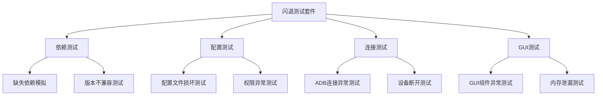

### 2. 用户场景测试

| 测试场景 | 测试目标 | 验证点 | 预期结果 |
|----------|----------|--------|----------|
| 首次安装使用 | 新用户体验 | 环境检查、配置创建 | 顺利启动并显示引导 |
| 设备连接失败 | 错误处理能力 | 错误提示、恢复建议 | 友好错误信息和解决方案 |
| 长时间运行稳定性 | 内存和性能 | 资源使用、响应时间 | 无内存泄漏，响应及时 |
| 异常环境适应性 | 兼容性测试 | 不同系统、设备型号 | 广泛兼容性支持 |

## 技术实现要点

### 1. 依赖检查实现

```python
# 伪代码示例
class DependencyChecker:
    def __init__(self):
        self.required_packages = self._load_requirements()
        self.system_requirements = {
            'python_version': (3, 8),
            'adb_command': 'adb',
            'required_dirs': ['logs', 'data', 'backups']
        }
    
    def check_all_dependencies(self):
        results = {
            'python_version': self._check_python_version(),
            'packages': self._check_packages(),
            'adb_available': self._check_adb(),
            'directories': self._check_directories(),
            'permissions': self._check_permissions()
        }
        return results
    
    def generate_fix_suggestions(self, check_results):
        suggestions = []
        for check, result in check_results.items():
            if not result['passed']:
                suggestions.extend(result['fix_suggestions'])
        return suggestions
```

### 2. 配置验证机制

```python
# 配置验证架构
class ConfigValidator:
    def __init__(self):
        self.validators = {
            'adb': self._validate_adb_config,
            'paths': self._validate_path_config,
            'network': self._validate_network_config,
            'ui': self._validate_ui_config
        }
    
    def validate_all(self, config):
        validation_results = {}
        for section, validator in self.validators.items():
            try:
                validation_results[section] = validator(config)
            except Exception as e:
                validation_results[section] = {
                    'valid': False,
                    'error': str(e),
                    'fix_action': 'reset_to_default'
                }
        return validation_results
```

### 3. 异常恢复框架

```python
# 异常恢复策略
class RecoveryManager:
    def __init__(self):
        self.recovery_strategies = {
            ImportError: self._handle_import_error,
            ConnectionError: self._handle_connection_error,
            ConfigurationError: self._handle_config_error,
            PermissionError: self._handle_permission_error
        }
    
    def handle_exception(self, exception, context):
        strategy = self.recovery_strategies.get(type(exception))
        if strategy:
            return strategy(exception, context)
        else:
            return self._handle_unknown_error(exception, context)
    
    def _generate_user_message(self, error_type, recovery_action):
        # 生成用户友好的错误信息和解决建议
        pass
```

## 监控与维护

### 1. 实时监控系统

#### 应用健康监控

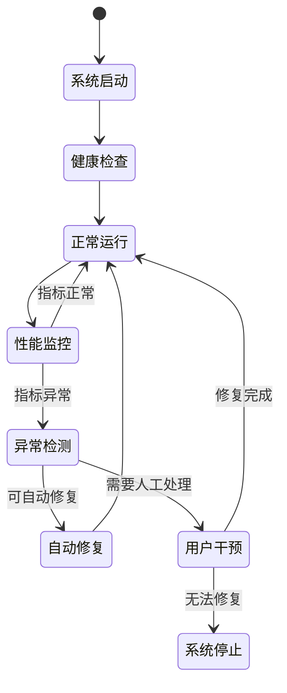

#### 监控指标体系

| 监控类别 | 监控指标 | 正常范围 | 异常处理 |
|----------|----------|----------|----------|
| 系统资源 | CPU使用率 | < 80% | 进程优化 |
| 系统资源 | 内存使用量 | < 1GB | 内存清理 |
| 网络连接 | ADB连接状态 | 连接正常 | 自动重连 |
| 应用响应 | UI响应时间 | < 2秒 | 异步处理优化 |
| 错误率 | 异常发生频率 | < 1次/分钟 | 根因分析 |

### 2. 日志管理系统

#### 日志分级策略

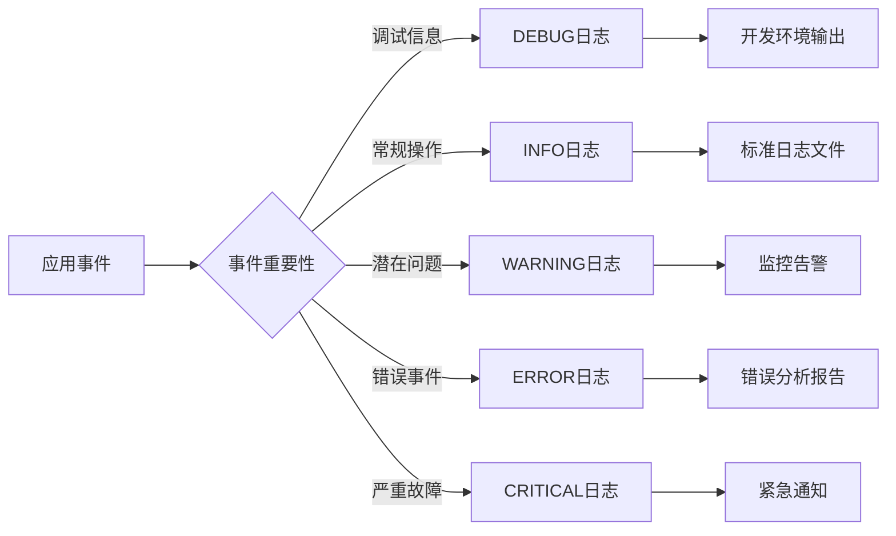

#### 日志存储与轮转

| 配置项 | 默认值 | 说明 | 调整建议 |
|--------|--------|------|---------|
| 单文件最大大小 | 10MB | 避免单文件过大 | 根据磁盘空间调整 |
| 保留文件数量 | 5个 | 历史日志保留 | 重要环境可增加 |
| 压缩存储 | 启用 | 节省存储空间 | 性能敏感时可关闭 |
| 缓冲区大小 | 1000条 | 批量写入优化 | 高频日志环境增大 |

## 部署与配置指南

### 1. 环境要求验证

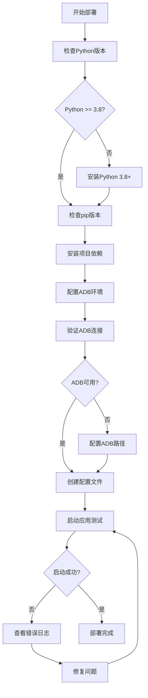

### 2. 配置文件模板

#### 生产环境配置

```ini
# 生产环境配置模板
[app]
name = Android系统修复工具
version = 1.0.0
environment = production

[logging]
level = INFO
file = logs/app.log
max_size = 50MB
backup_count = 10
enable_console = false

[adb]
timeout = 60
retry_count = 5
port = 5037
auto_detect_adb = true

[security]
enable_virus_scan = true
auto_quarantine = true
scan_timeout = 600

[ui]
auto_connect = false
window_width = 1200
window_height = 800
```

#### 开发环境配置

```ini
# 开发环境配置模板
[app]
name = Android系统修复工具[开发版]
version = 1.0.0-dev
environment = development

[logging]
level = DEBUG
file = logs/dev.log
max_size = 10MB
backup_count = 3
enable_console = true

[adb]
timeout = 30
retry_count = 3
port = 5037

[security]
enable_virus_scan = false
auto_quarantine = false

[ui]
auto_connect = true
window_width = 1000
window_height = 700
```

### 3. 批量部署脚本

#### Windows批量安装脚本

```batch
@echo off
echo Android系统修复工具 - 自动部署脚本
echo =====================================

:: 检查Python安装
python --version >nul 2>&1
if errorlevel 1 (
    echo 错误: 未找到Python，请先安装Python 3.8+
    pause
    exit /b 1
)

:: 安装依赖
echo 正在安装Python依赖包...
pip install -r requirements.txt
if errorlevel 1 (
    echo 错误: 依赖安装失败
    pause
    exit /b 1
)

:: 检查ADB
adb version >nul 2>&1
if errorlevel 1 (
    echo 警告: 未找到ADB工具，请手动配置ADB路径
)

:: 创建必要目录
mkdir logs 2>nul
mkdir data 2>nul
mkdir backups 2>nul

:: 启动应用
echo 启动应用程序...
python main.py

pause
```

## 性能优化策略

### 1. 内存管理优化

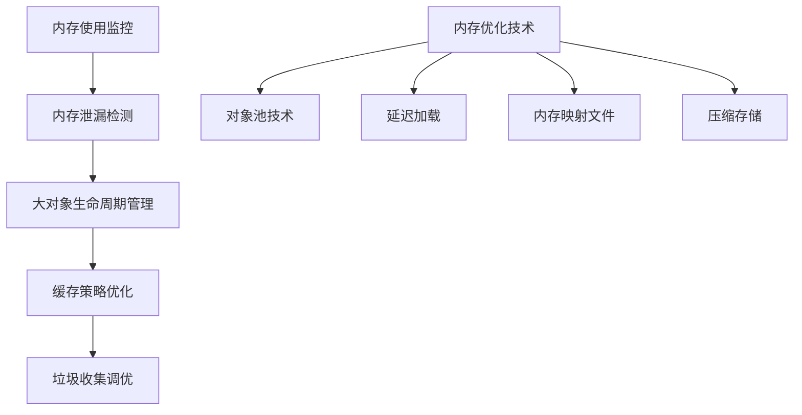

#### 内存优化配置

| 优化项目 | 实现方式 | 预期效果 | 配置参数 |
|----------|----------|----------|----------|
| ADB连接池 | 复用连接对象 | 减少连接开销 | max_connections=5 |
| 日志缓冲 | 批量写入机制 | 降低IO频率 | buffer_size=1000 |
| 扫描结果缓存 | LRU缓存策略 | 避免重复计算 | cache_size=100 |
| GUI组件懒加载 | 按需创建组件 | 降低启动内存 | lazy_loading=true |

### 2. 响应性能优化

#### 异步处理架构

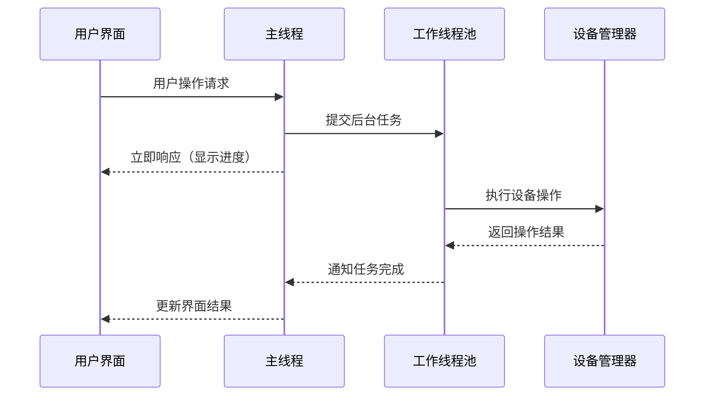

#### 性能监控指标

| 性能指标 | 目标值 | 监控方式 | 优化措施 |
|----------|--------|----------|----------|
| 应用启动时间 | < 3秒 | 启动耗时统计 | 预加载优化 |
| 设备扫描响应 | < 5秒 | 操作响应时间 | 异步处理 |
| 内存使用峰值 | < 500MB | 内存监控 | 对象生命周期管理 |
| CPU使用率 | < 50% | 系统资源监控 | 算法优化 |

## 安全考虑

### 1. 数据安全保护

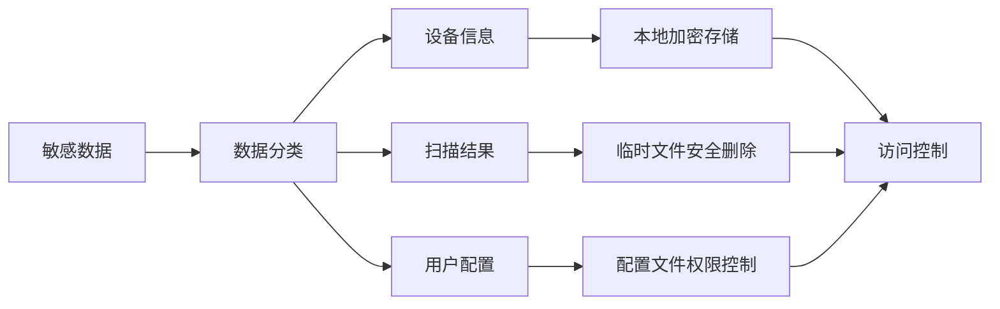

#### 数据保护措施

| 数据类型 | 保护级别 | 保护措施 | 实现方式 |
|----------|----------|----------|----------|
| 设备标识信息 | 高 | 本地加密 | AES-256加密 |
| 扫描临时文件 | 中 | 安全删除 | 多次覆写删除 |
| 配置文件 | 中 | 权限限制 | 文件系统权限 |
| 日志文件 | 低 | 敏感信息过滤 | 正则表达式过滤 |

### 2. 权限管理

#### 最小权限原则

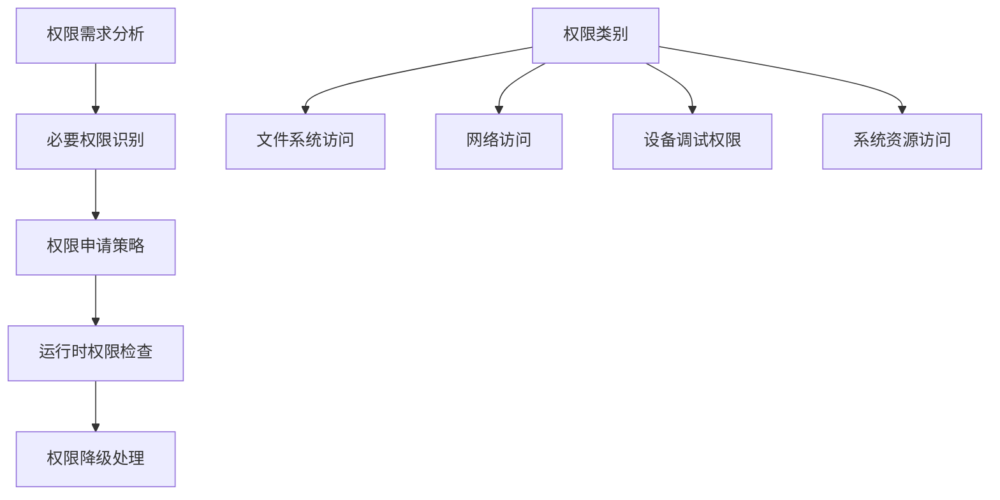

## 测试验证

### 1. 自动化测试框架

```python
# 测试框架示例
class CrashResistanceTest:
    def __init__(self):
        self.test_scenarios = [
            self.test_missing_dependencies,
            self.test_corrupted_config,
            self.test_adb_connection_failure,
            self.test_device_disconnection,
            self.test_memory_pressure,
            self.test_permission_denied
        ]
    
    def run_all_tests(self):
        results = {}
        for test in self.test_scenarios:
            try:
                results[test.__name__] = test()
            except Exception as e:
                results[test.__name__] = {'passed': False, 'error': str(e)}
        return results
    
    def test_missing_dependencies(self):
        # 模拟依赖缺失情况
        pass
    
    def test_corrupted_config(self):
        # 模拟配置文件损坏
        pass
```

### 2. 用户验收测试

#### 测试用例矩阵

| 测试类别 | 测试场景 | 验证点 | 通过标准 |
|----------|----------|--------|----------|
| 基础功能 | 应用正常启动 | 界面显示完整 | 无异常退出 |
| 错误恢复 | 配置文件损坏 | 自动重建配置 | 应用正常运行 |
| 设备连接 | ADB连接异常 | 错误提示友好 | 提供解决方案 |
| 性能测试 | 长时间运行 | 内存使用稳定 | 无明显性能退化 |
| 兼容性测试 | 多种设备型号 | 广泛兼容性 | 主流设备支持 |
```