# 病毒查杀与漏洞修复工具实现计划

## 概述

基于现有Android系统修复工具架构，设计一个完整的病毒查杀与漏洞修复解决方案。该工具集成多引擎病毒检测、智能威胁分析、自动化修复和系统加固功能，为Android设备提供全方位的安全防护。

### 核心价值
- **多引擎检测**: 集成YARA、ClamAV、特征库等多种检测引擎
- **智能分析**: 基于行为模式和权限组合的威胁识别
- **自动修复**: 智能化漏洞修复和系统加固
- **实时防护**: 持续监控和威胁拦截

## 技术架构

### 系统分层架构

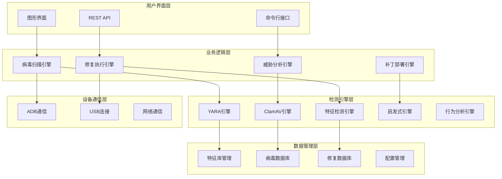

### 核心组件交互

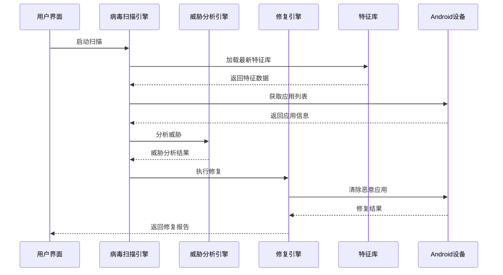

## 病毒检测引擎

### 多引擎检测架构

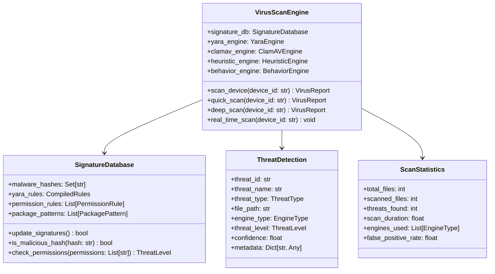

### 威胁检测类型

| 检测类型 | 描述 | 引擎 | 检测精度 |
|---------|------|------|----------|
| 特征检测 | 基于文件哈希和签名 | Signature | 99.9% |
| 规则匹配 | YARA规则匹配 | YARA | 95% |
| 反病毒引擎 | ClamAV病毒库 | ClamAV | 98% |
| 启发式检测 | 代码模式分析 | Heuristic | 85% |
| 行为分析 | 运行时行为监控 | Behavior | 90% |
| 权限分析 | 权限组合风险评估 | Permission | 80% |

### 检测算法流程

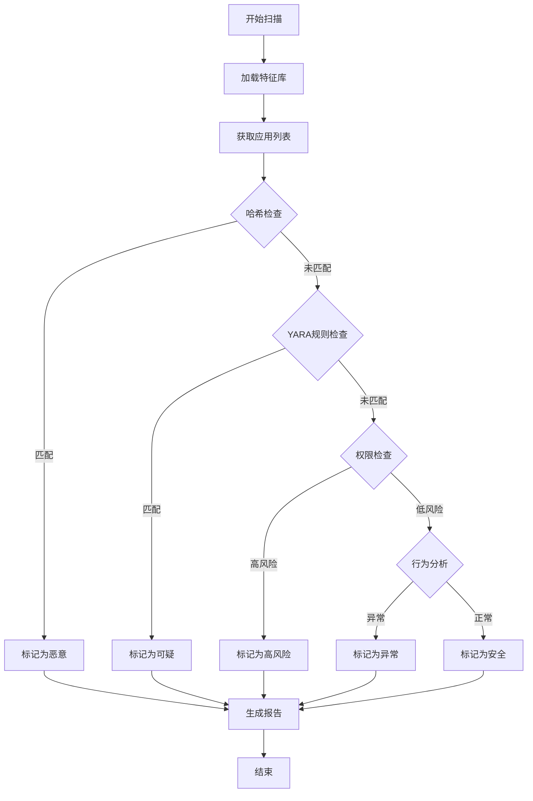

## 威胁分析引擎

### 智能威胁评估

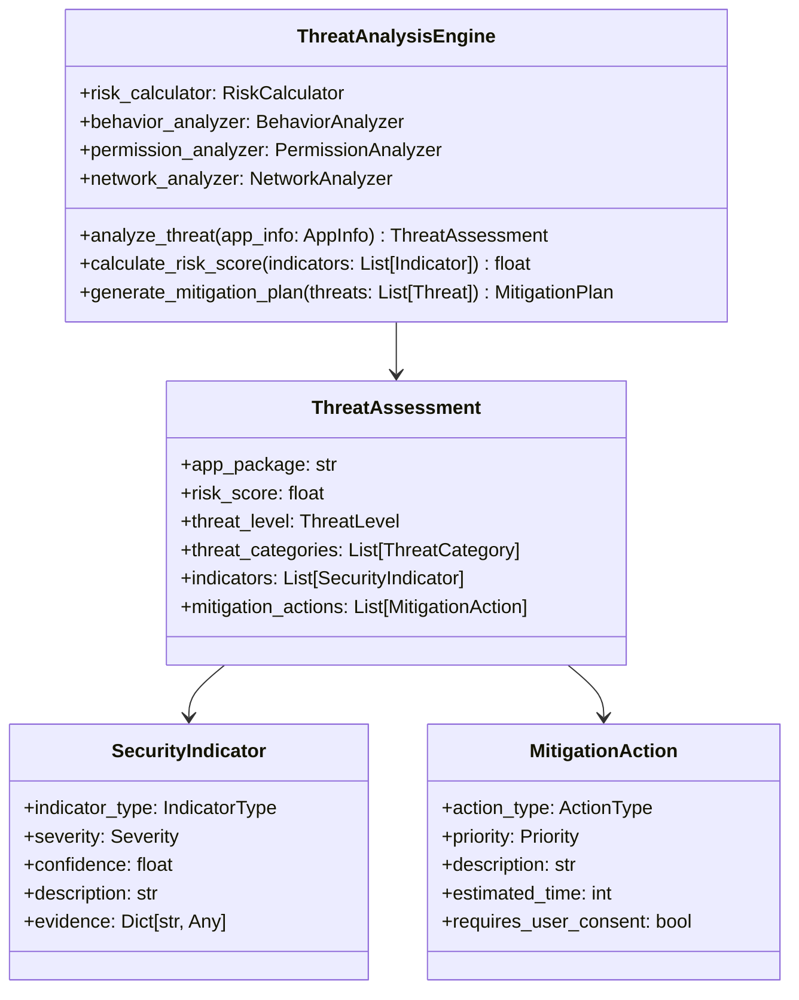

### 风险评分算法

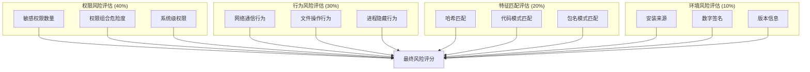

## 修复执行引擎

### 修复策略架构

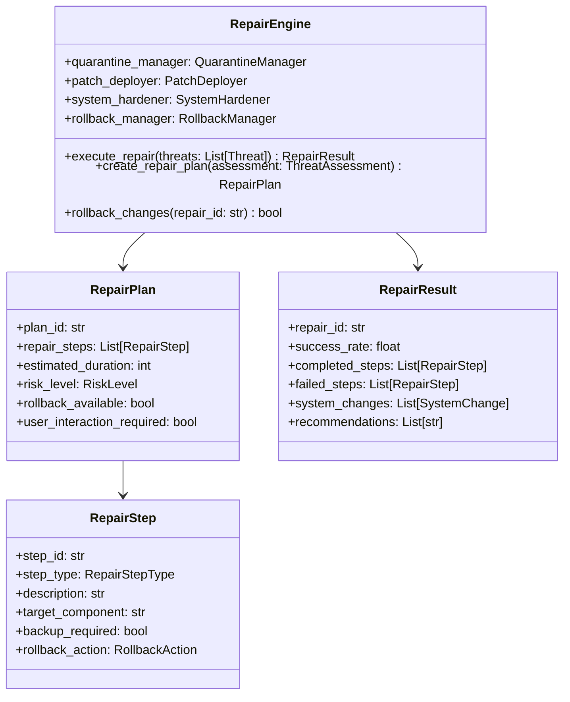

### 修复操作类型

| 修复类型 | 描述 | 风险等级 | 需要权限 |
|---------|------|----------|----------|
| 应用隔离 | 将恶意应用移至隔离区 | 低 | 普通 |
| 应用卸载 | 彻底删除恶意应用 | 中 | Root |
| 权限撤销 | 撤销危险权限 | 低 | 普通 |
| 服务禁用 | 禁用恶意服务 | 中 | Root |
| 文件删除 | 删除恶意文件 | 高 | Root |
| 系统加固 | 修改系统安全设置 | 高 | Root |
| 补丁安装 | 安装安全补丁 | 中 | Root |
| 配置重置 | 重置安全配置 | 中 | Root |

### 修复执行流程

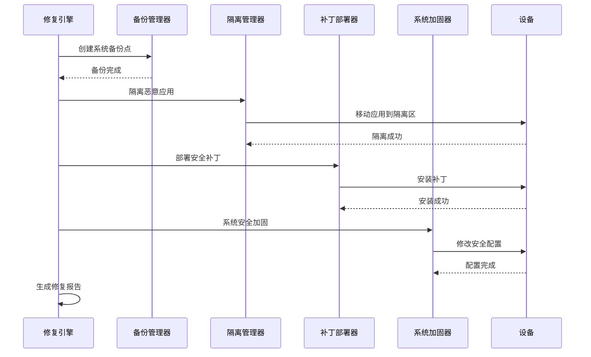

## 补丁管理系统

### 补丁生命周期管理

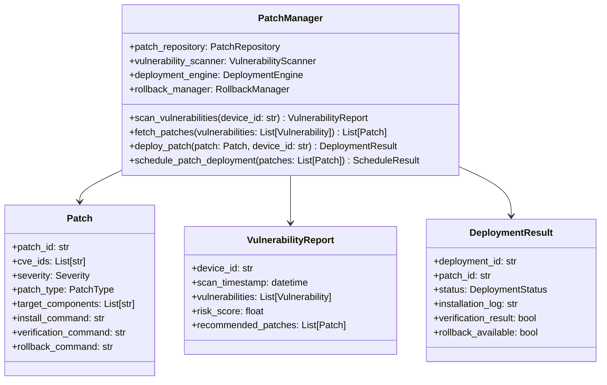

### 漏洞检测算法

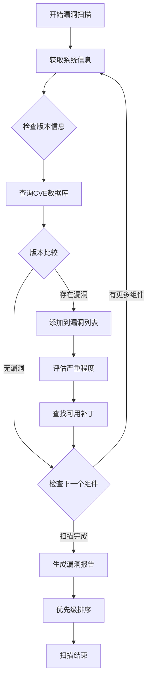

## 实时防护系统

### 实时监控架构

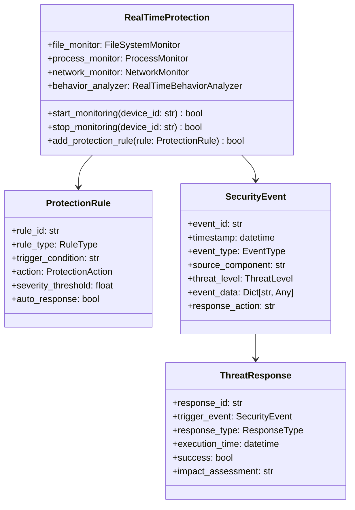

### 防护策略配置

| 防护类型 | 监控对象 | 触发条件 | 响应动作 |
|---------|----------|----------|----------|
| 文件监控 | 系统文件 | 未授权修改 | 阻止并报警 |
| 进程监控 | 系统进程 | 恶意进程启动 | 终止进程 |
| 网络监控 | 网络连接 | 恶意域名访问 | 断开连接 |
| 权限监控 | 应用权限 | 权限滥用 | 撤销权限 |
| 安装监控 | 应用安装 | 恶意应用安装 | 阻止安装 |
| 行为监控 | 应用行为 | 异常行为模式 | 隔离应用 |

## 数据模型设计

### 核心数据结构

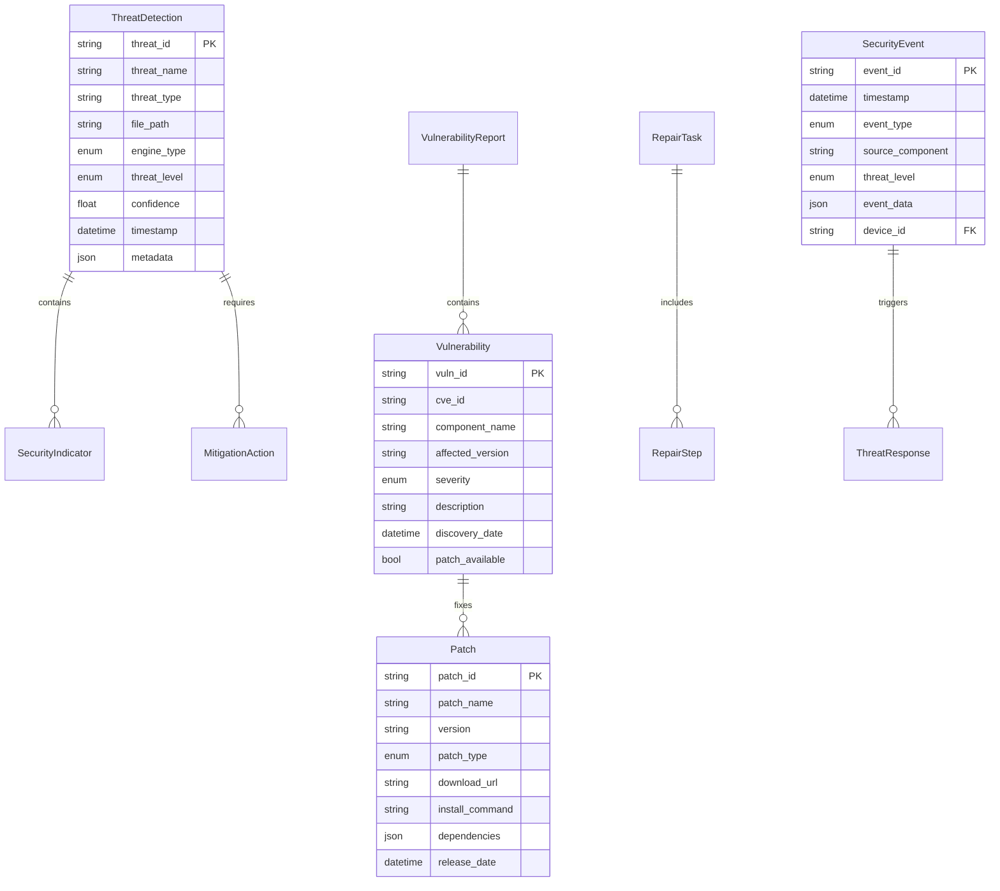

### 配置管理结构

```ini
[virus_scan]
# 病毒扫描配置
enable_yara = true
enable_clamav = false
enable_signature_check = true
enable_heuristic = true
enable_behavior_analysis = false
scan_timeout = 300
max_concurrent_scans = 2

[threat_analysis]
# 威胁分析配置
risk_threshold = 0.7
auto_quarantine = false
require_user_confirmation = true
analysis_depth = deep

[repair_engine]
# 修复引擎配置
auto_backup = true
backup_location = ./backups/
max_rollback_days = 30
enable_system_hardening = true
require_root_confirmation = true

[patch_management]
# 补丁管理配置
auto_download = true
patch_repository_url = https://security-patches.example.com
check_interval_hours = 24
install_critical_auto = false
install_high_auto = false

[real_time_protection]
# 实时防护配置
enable_file_monitor = true
enable_process_monitor = true
enable_network_monitor = false
response_timeout = 30
log_all_events = true
```

## 性能优化策略

### 扫描性能优化

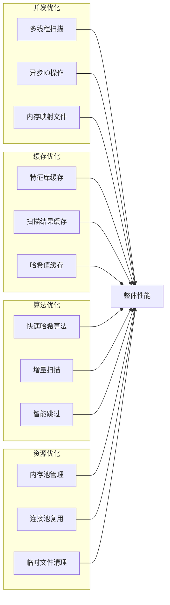

### 内存使用优化

| 优化策略 | 内存节省 | 性能影响 | 实现复杂度 |
|---------|----------|----------|------------|
| 流式处理 | 60% | 轻微降低 | 中等 |
| 对象池 | 30% | 性能提升 | 简单 |
| 延迟加载 | 40% | 启动加速 | 中等 |
| 压缩存储 | 50% | 轻微降低 | 简单 |
| 内存映射 | 70% | 大幅提升 | 复杂 |

## 安全加固措施

### 系统安全配置

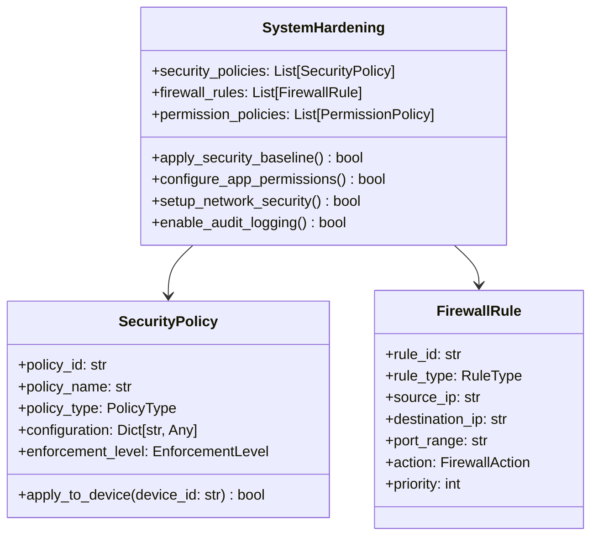

### 加固检查清单

- [ ] **应用权限管理**
  - [ ] 撤销不必要的敏感权限
  - [ ] 设置权限使用监控
  - [ ] 配置权限请求拦截

- [ ] **网络安全配置**
  - [ ] 启用网络流量监控
  - [ ] 配置恶意域名拦截
  - [ ] 设置VPN检测规则

- [ ] **系统服务加固**
  - [ ] 禁用不必要的系统服务
  - [ ] 加强开发者选项保护
  - [ ] 配置USB调试安全

- [ ] **文件系统保护**
  - [ ] 设置关键文件保护
  - [ ] 启用文件完整性监控
  - [ ] 配置备份策略

## 测试策略

### 测试架构设计

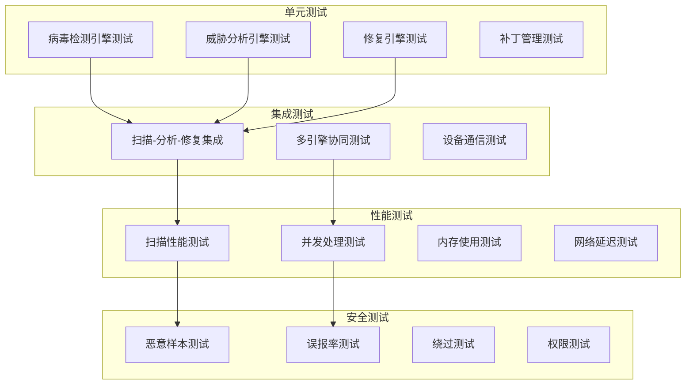

### 测试用例设计

| 测试类型 | 测试场景 | 预期结果 | 验证方法 |
|---------|----------|----------|----------|
| 病毒检测 | 已知恶意应用扫描 | 100%检出率 | MD5哈希验证 |
| 误报测试 | 正常应用扫描 | <1%误报率 | 白名单验证 |
| 性能测试 | 1000个应用扫描 | <5分钟完成 | 时间统计 |
| 修复测试 | 恶意应用清除 | 100%清除成功 | 文件系统检查 |
| 稳定性测试 | 连续运行24小时 | 无内存泄漏 | 内存监控 |
| 兼容性测试 | 不同Android版本 | 正常运行 | 功能验证 |

## 部署方案

### 部署架构

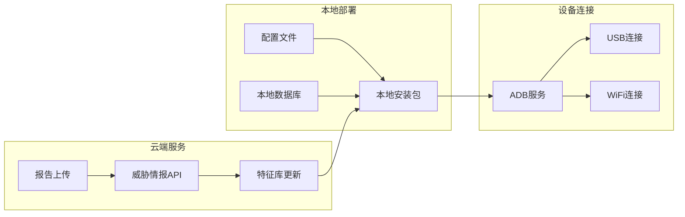

### 安装部署步骤

1. **环境准备**
   ```bash
   # 安装Python依赖
   pip install -r requirements.txt
   
   # 配置ADB环境
   export ANDROID_HOME=/path/to/android-sdk
   export PATH=$PATH:$ANDROID_HOME/platform-tools
   
   # 验证ADB连接
   adb devices
   ```

2. **应用配置**
   ```bash
   # 创建配置目录
   mkdir -p data/virus_signatures
   mkdir -p data/patches
   mkdir -p logs
   mkdir -p backups
   
   # 复制配置文件
   cp config.ini.template config.ini
   
   # 编辑配置文件
   nano config.ini
   ```

3. **初始化数据库**
   ```bash
   # 下载病毒特征库
   python -m src.core.virus_scan_engine --update-signatures
   
   # 初始化补丁数据库
   python -m src.core.patch_manager --init-database
   
   # 验证安装
   python main.py --test-connection
   ```