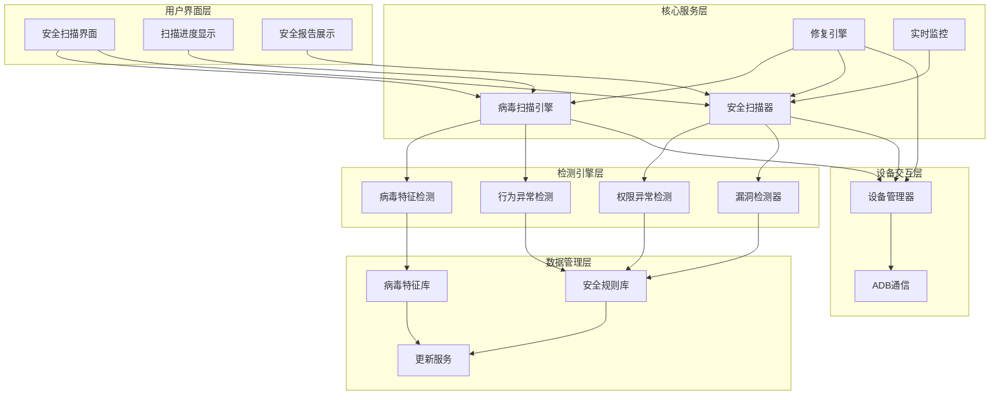
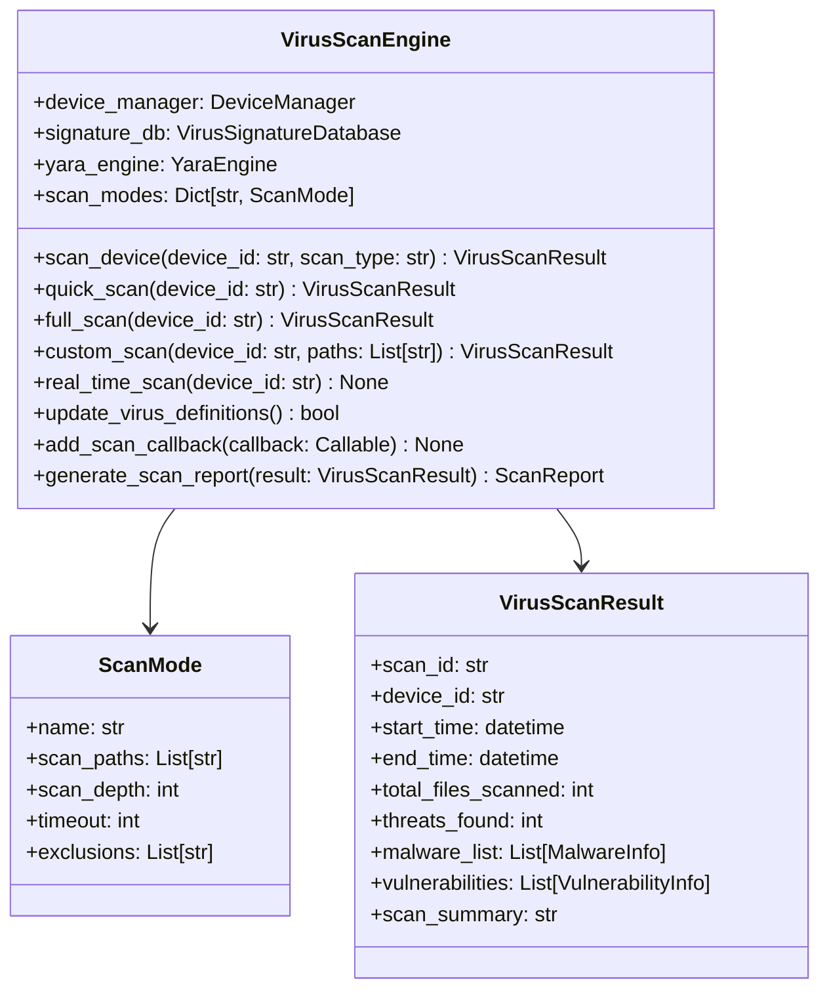
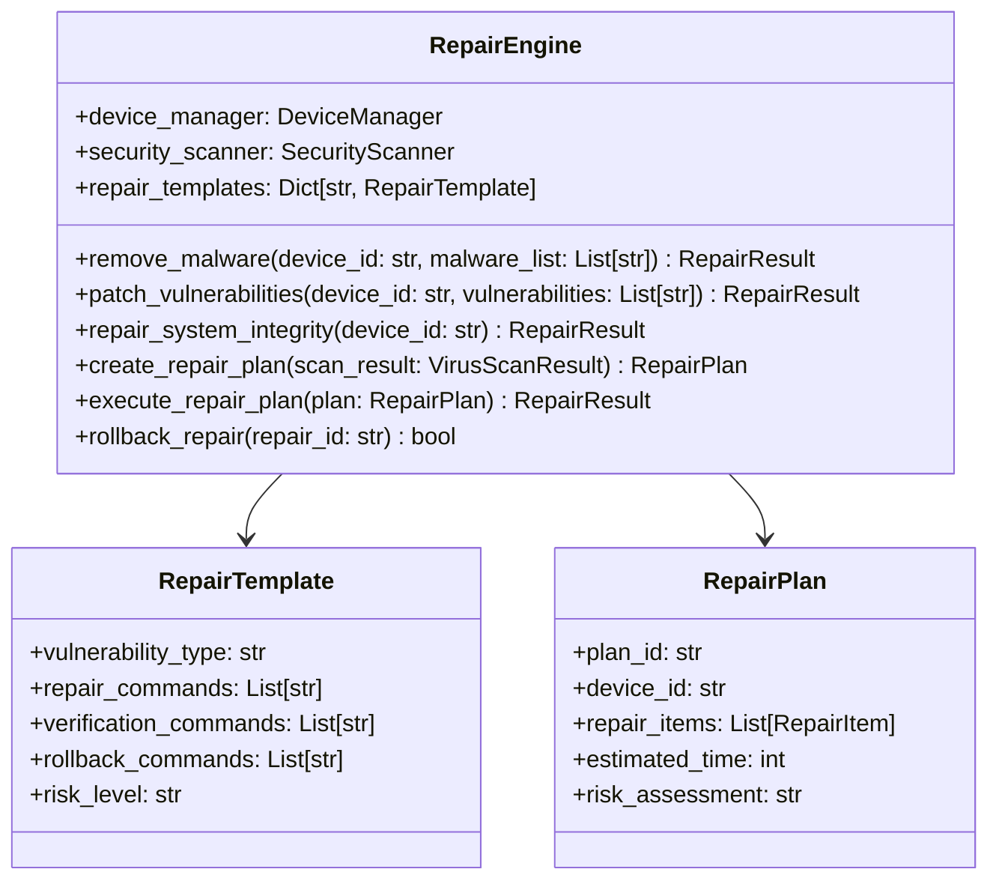
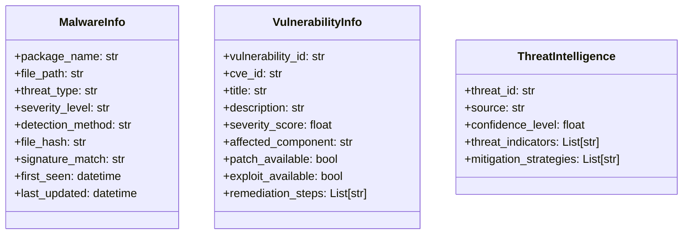
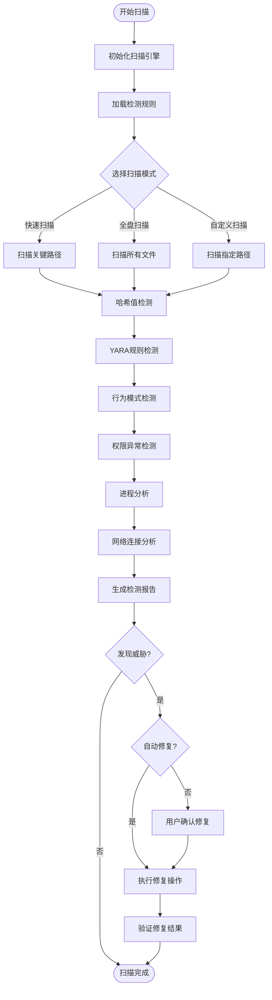
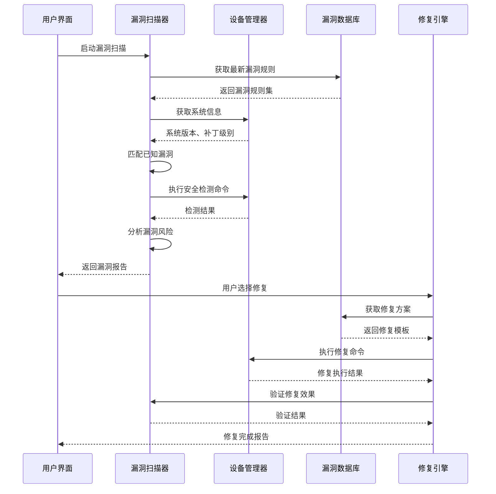
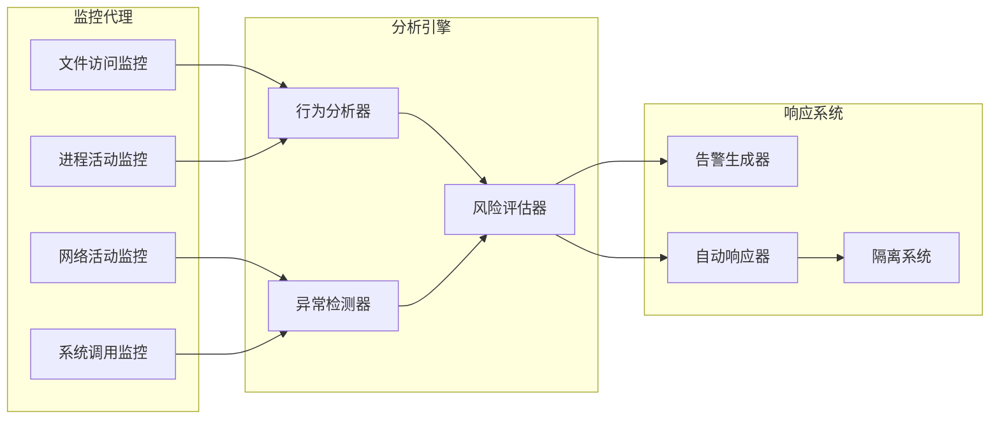
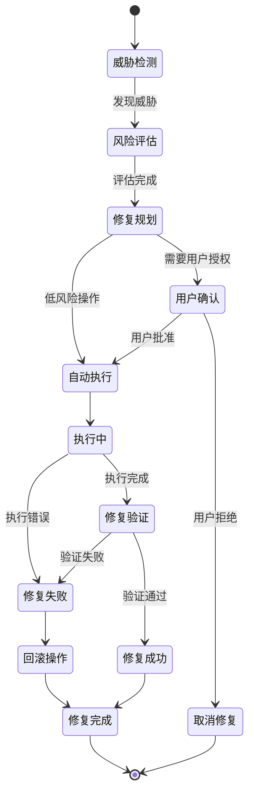

# 病毒查杀与漏洞修复工具设计文档

## 概览

病毒查杀与漏洞修复工具是Android系统修复工具的核心安全模块，集成了病毒检测、恶意软件清除和系统漏洞修复功能。该工具通过多层安全检测机制，为Android设备提供全面的安全保护和修复服务。

### 核心价值

- **多维度威胁检测**：结合特征匹配、行为分析和权限异常检测
- **自动化修复流程**：从检测到清除的完整自动化处理
- **实时安全监控**：持续监控设备安全状态
- **漏洞智能修复**：基于规则的系统漏洞自动修复

### 技术架构



## 组件架构

### 核心组件定义

#### 1. VirusScanEngine (病毒扫描引擎)
负责协调整个病毒检测流程，集成多种检测算法。



#### 2. SecurityScanner (安全扫描器)
执行具体的安全检测任务，包括应用扫描、进程监控等。

#### 3. RepairEngine (修复引擎) 
负责执行安全威胁的清除和系统漏洞的修复。



### 数据模型

#### 威胁信息模型



## 功能特性设计

### 1. 病毒检测功能

#### 多引擎检测机制



#### 检测算法实现

| 检测方法 | 描述 | 准确率 | 性能影响 |
|---------|-----|--------|---------|
| 哈希匹配 | 基于已知恶意软件的文件哈希值 | 99% | 低 |
| YARA规则 | 基于代码特征和行为模式的规则匹配 | 95% | 中等 |
| 权限分析 | 检测异常权限组合和权限滥用 | 85% | 低 |
| 行为监控 | 实时监控应用行为和系统调用 | 90% | 高 |
| 网络分析 | 检测可疑的网络连接和通信 | 80% | 中等 |

### 2. 漏洞扫描与修复

#### 漏洞检测流程



#### 漏洞分类与修复策略

| 漏洞类型 | 风险等级 | 修复策略 | 自动修复 |
|---------|---------|---------|---------|
| 权限提升漏洞 | 高 | 权限重置、补丁安装 | 否 |
| 应用安全漏洞 | 中 | 应用更新、权限限制 | 是 |
| 系统配置漏洞 | 中 | 配置修正、安全加固 | 是 |
| 网络安全漏洞 | 高 | 防火墙配置、服务关闭 | 否 |
| 数据泄露风险 | 高 | 权限审计、数据加密 | 否 |

### 3. 实时监控系统

#### 监控架构设计



#### 监控指标定义

| 监控维度 | 关键指标 | 阈值设定 | 响应动作 |
|---------|---------|---------|---------|
| 进程行为 | CPU使用率、内存占用、文件访问频率 | CPU>80%, 内存>500MB | 进程分析、权限检查 |
| 网络活动 | 连接数量、数据传输量、目标地址 | 连接>100, 流量>100MB/h | 网络隔离、流量分析 |
| 文件操作 | 文件修改、删除、权限变更 | 系统文件被修改 | 文件保护、操作回滚 |
| 权限使用 | 敏感权限调用、权限提升尝试 | 异常权限请求 | 权限拒绝、用户确认 |

### 4. 安全修复机制

#### 修复执行流程



#### 修复操作类别

**恶意软件清除**
- 应用卸载：通过ADB命令安全卸载恶意应用
- 文件删除：清除恶意文件和残留数据
- 权限撤销：撤销恶意应用的敏感权限

**系统漏洞修复**
- 配置修正：修复不安全的系统配置
- 补丁安装：安装可用的安全补丁
- 服务管理：关闭不必要的系统服务

**权限安全加固**
- 权限审计：审查和调整应用权限
- 访问控制：加强文件和系统访问控制
- 安全策略：应用系统级安全策略

## API接口设计

### 核心接口定义

#### 病毒扫描接口

```python
# 扫描设备接口
POST /api/v1/scan/device
{
    "device_id": "string",
    "scan_type": "quick|full|custom",
    "scan_paths": ["path1", "path2"],  # 仅custom模式
    "options": {
        "deep_scan": true,
        "scan_timeout": 3600,
        "exclude_paths": ["/system/cache"]
    }
}

# 获取扫描结果
GET /api/v1/scan/result/{scan_id}

# 获取扫描进度
GET /api/v1/scan/progress/{scan_id}
```

#### 修复操作接口

```python
# 创建修复计划
POST /api/v1/repair/plan
{
    "device_id": "string",
    "scan_result_id": "string",
    "repair_options": {
        "auto_remove_malware": true,
        "auto_patch_vulnerabilities": false,
        "create_backup": true
    }
}

# 执行修复操作
POST /api/v1/repair/execute
{
    "repair_plan_id": "string",
    "confirmation_token": "string"
}

# 回滚修复操作
POST /api/v1/repair/rollback
{
    "repair_id": "string"
}
```

#### 实时监控接口

```python
# 启动实时监控
POST /api/v1/monitor/start
{
    "device_id": "string",
    "monitor_config": {
        "scan_interval": 30,
        "alert_threshold": "medium",
        "auto_response": false
    }
}

# 获取监控状态
GET /api/v1/monitor/status/{device_id}

# 获取安全事件
GET /api/v1/monitor/events/{device_id}?limit=50&offset=0
```

### 数据交换格式

#### 扫描结果数据结构

```json
{
    "scan_id": "uuid",
    "device_id": "device_uuid",
    "scan_type": "full",
    "status": "completed",
    "start_time": "2024-01-15T10:00:00Z",
    "end_time": "2024-01-15T10:45:00Z",
    "statistics": {
        "total_files_scanned": 15420,
        "total_apps_scanned": 127,
        "scan_duration": 2700,
        "threats_detected": 3,
        "vulnerabilities_found": 5
    },
    "threats": [
        {
            "threat_id": "uuid",
            "type": "malware",
            "name": "Android.Trojan.FakeApp",
            "severity": "high",
            "file_path": "/data/app/com.suspicious.app",
            "package_name": "com.suspicious.app",
            "detection_method": "signature",
            "confidence": 0.95
        }
    ],
    "vulnerabilities": [
        {
            "vulnerability_id": "uuid",
            "cve_id": "CVE-2024-0001",
            "title": "权限提升漏洞",
            "severity": "medium",
            "cvss_score": 6.5,
            "affected_component": "system_server",
            "patch_available": true
        }
    ]
}
```

## 测试策略

### 单元测试

#### 核心组件测试

```python
class TestVirusScanEngine:
    """病毒扫描引擎测试用例"""
    
    def test_quick_scan_execution(self):
        """测试快速扫描功能"""
        pass
        
    def test_malware_detection_accuracy(self):
        """测试恶意软件检测准确性"""
        pass
        
    def test_scan_progress_callback(self):
        """测试扫描进度回调机制"""
        pass
        
    def test_virus_definition_update(self):
        """测试病毒库更新功能"""
        pass

class TestRepairEngine:
    """修复引擎测试用例"""
    
    def test_malware_removal(self):
        """测试恶意软件清除功能"""
        pass
        
    def test_vulnerability_patching(self):
        """测试漏洞修复功能"""
        pass
        
    def test_repair_rollback(self):
        """测试修复回滚功能"""
        pass
        
    def test_repair_plan_generation(self):
        """测试修复计划生成"""
        pass
```

### 集成测试场景

| 测试场景 | 测试目标 | 验证要点 |
|---------|---------|---------|
| 端到端扫描流程 | 完整扫描和修复流程 | 扫描准确性、修复有效性 |
| 多设备并发扫描 | 并发处理能力 | 性能稳定性、资源管理 |
| 大规模文件扫描 | 大数据量处理 | 内存使用、扫描速度 |
| 网络异常处理 | 网络中断场景 | 错误恢复、数据完整性 |
| 设备异常处理 | 设备断开连接 | 异常检测、优雅降级 |

### 性能测试指标

| 性能指标 | 目标值 | 测试方法 |
|---------|--------|---------|
| 扫描速度 | >1000文件/分钟 | 标准设备文件集扫描 |
| 内存使用 | <500MB | 大规模扫描监控 |
| CPU使用率 | <60% | 长时间扫描监控 |
| 响应时间 | <3秒 | API接口响应测试 |
| 并发能力 | 10个设备同时扫描 | 并发压力测试 |