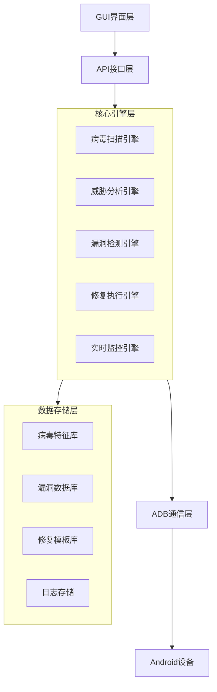
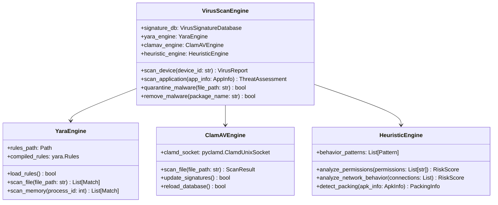
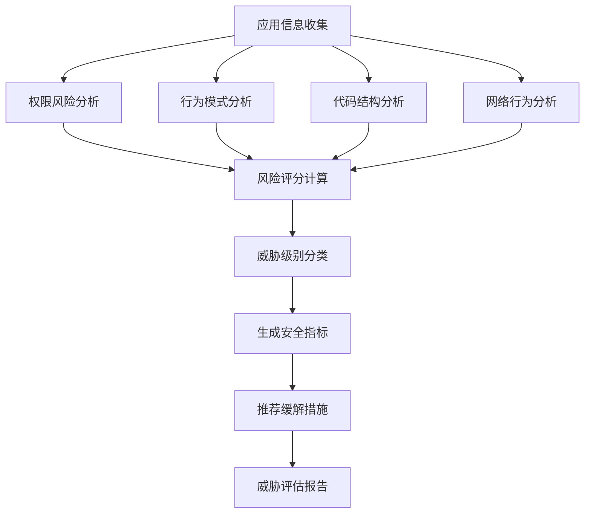
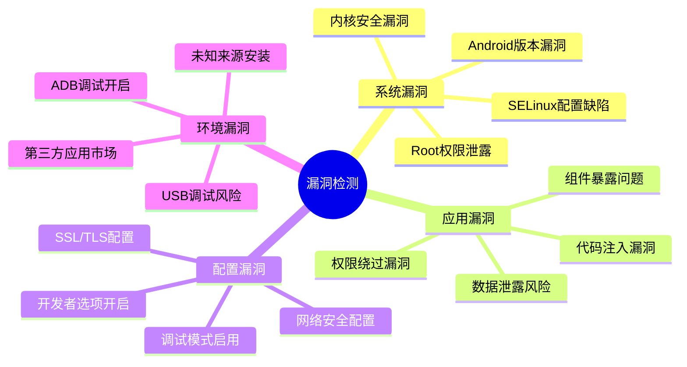
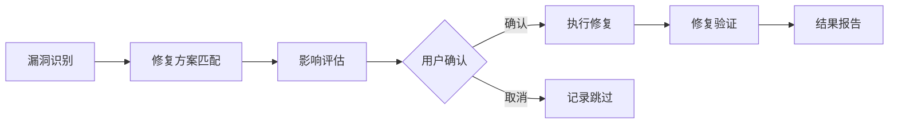
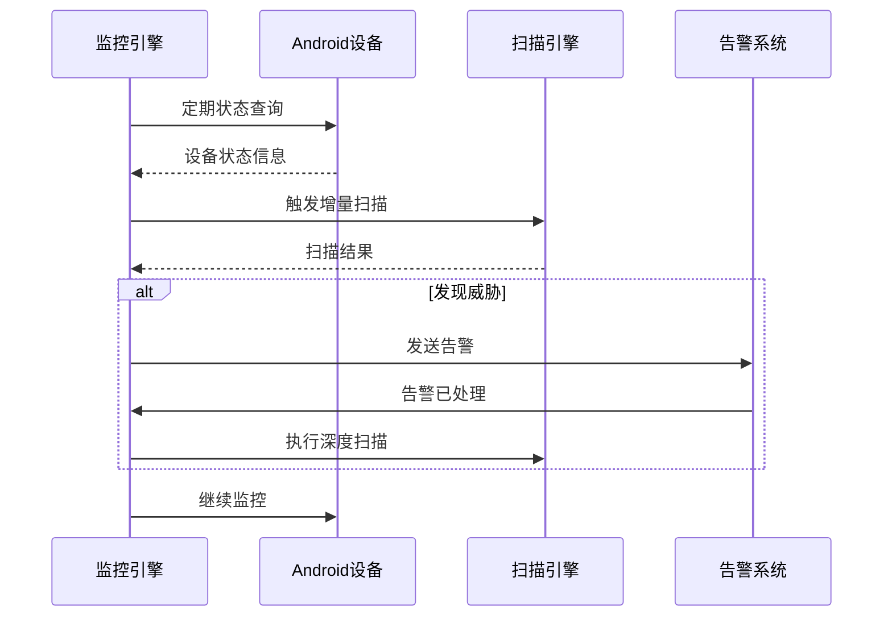
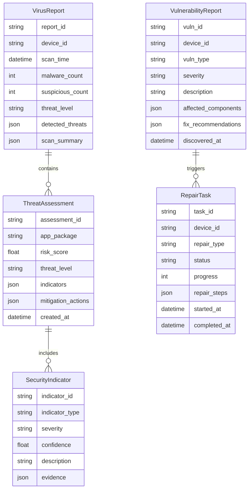
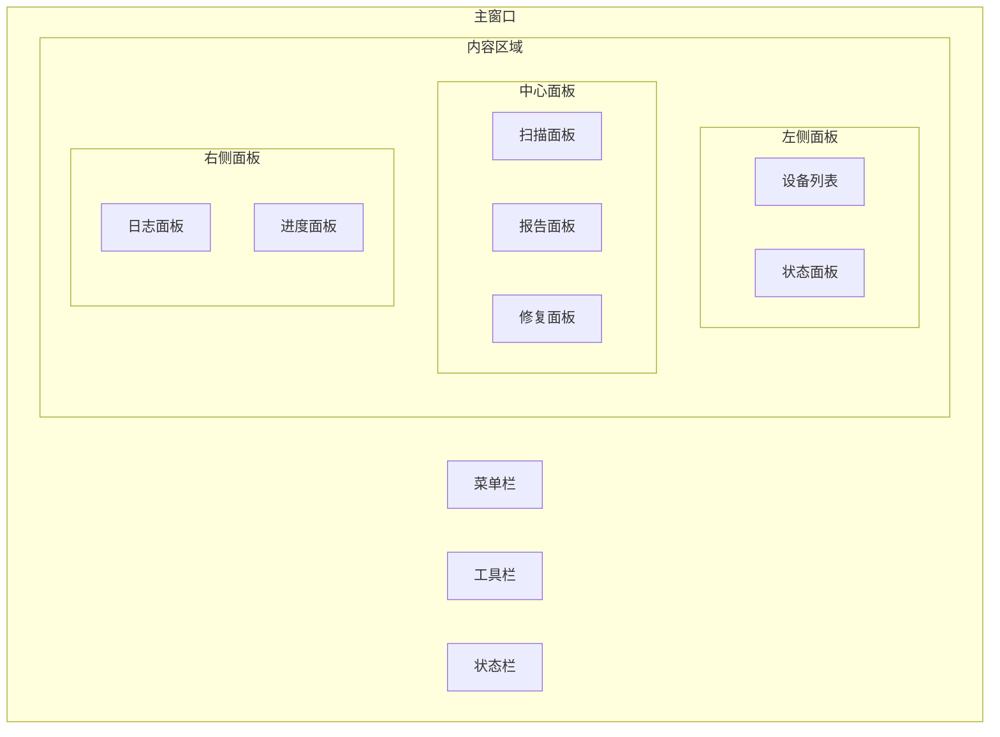

# 病毒查杀与漏洞修复工具设计文档

## 概述

病毒查杀与漏洞修复工具是一个基于Python开发的Android设备安全防护系统，集成了病毒扫描、威胁分析、漏洞检测和自动修复功能。该工具通过ADB协议与Android设备通信，提供实时安全监控、恶意软件检测、系统漏洞修复和安全加固服务。

### 核心价值
- 提供全面的Android设备安全防护
- 实时检测和清除恶意软件
- 自动化漏洞扫描和修复
- 智能威胁分析和风险评估
- 用户友好的图形化操作界面

### 目标用户
- Android设备用户
- 移动设备安全管理员
- 企业移动设备管理(MDM)服务提供商
- 安全研究人员和技术人员

## 技术架构

### 整体架构图



### 分层架构设计

#### 1. GUI界面层 (Tkinter/PyQt)
- 主控制面板
- 扫描配置界面
- 实时监控状态显示
- 威胁报告展示
- 修复操作控制

#### 2. 核心引擎层
- **病毒扫描引擎**: 基于yara-python和pyclamd的多引擎检测
- **威胁分析引擎**: AI驱动的恶意行为分析
- **漏洞检测引擎**: 系统漏洞和配置缺陷检测
- **修复执行引擎**: 自动化修复操作调度
- **实时监控引擎**: 持续安全状态监控

#### 3. 数据存储层
- 病毒特征库管理
- 漏洞数据库维护
- 修复模板库
- 审计日志存储

## 核心功能模块

### 1. 病毒扫描模块

#### 扫描引擎架构


#### 扫描策略
- **实时扫描**: 监控新安装应用和文件变化
- **定时扫描**: 按预设计划执行全盘扫描
- **快速扫描**: 检查关键系统区域和常见感染位置
- **深度扫描**: 全面检查所有应用和系统文件
- **自定义扫描**: 用户指定扫描范围和深度

#### 检测机制
1. **特征匹配**: 基于病毒特征库的哈希值匹配
2. **YARA规则**: 使用YARA规则进行模式匹配
3. **启发式分析**: 基于行为模式的异常检测
4. **权限分析**: 检测危险权限组合
5. **网络行为**: 监控可疑网络连接

### 2. 威胁分析模块

#### 威胁评估流程


#### 分析维度
- **权限风险评估**: 分析应用请求权限的危险程度
- **行为模式分析**: 检测异常的运行时行为
- **代码结构分析**: 静态分析代码结构和调用关系
- **网络通信分析**: 监控网络连接和数据传输
- **文件操作分析**: 跟踪文件读写和修改行为

### 3. 漏洞检测模块

#### 检测范围


#### 漏洞评级
- **严重级**: 可导致设备完全控制的漏洞
- **高危级**: 可导致数据泄露或权限提升的漏洞
- **中危级**: 可影响系统稳定性的漏洞
- **低危级**: 轻微的安全配置问题

### 4. 修复执行模块

#### 修复策略


#### 修复类型
- **病毒清除**: 卸载恶意应用，清理感染文件
- **权限修复**: 重置应用权限，修复权限配置
- **系统加固**: 应用安全补丁，更新系统配置
- **配置优化**: 调整安全设置，关闭危险功能
- **防护加强**: 启用安全功能，安装保护组件

### 5. 实时监控模块

#### 监控架构


## 数据模型设计

### 核心数据模型


## 用户界面设计

### 主界面布局


### 界面功能分区

#### 1. 扫描控制面板
- 扫描类型选择（快速/全盘/自定义）
- 扫描选项配置
- 实时监控开关
- 扫描进度显示

#### 2. 威胁报告面板
- 威胁统计概览
- 详细威胁列表
- 风险等级分布图
- 修复建议显示

#### 3. 修复操作面板
- 修复任务列表
- 修复进度跟踪
- 修复结果展示
- 回滚操作选项

#### 4. 设备管理面板
- 连接设备列表
- 设备信息展示
- 连接状态监控
- 设备操作快捷入口

## API接口设计

### 核心API接口

#### 病毒扫描API
```python
class VirusScanAPI:
    def start_scan(self, device_id: str, scan_options: ScanOptions) -> str:
        """启动病毒扫描"""
        
    def get_scan_progress(self, scan_id: str) -> ScanProgress:
        """获取扫描进度"""
        
    def get_scan_report(self, scan_id: str) -> VirusReport:
        """获取扫描报告"""
        
    def cancel_scan(self, scan_id: str) -> bool:
        """取消扫描任务"""
```

#### 威胁分析API
```python
class ThreatAnalysisAPI:
    def analyze_application(self, app_info: AppInfo) -> ThreatAssessment:
        """分析应用威胁"""
        
    def get_threat_statistics(self, device_id: str) -> ThreatStats:
        """获取威胁统计"""
        
    def update_threat_rules(self) -> bool:
        """更新威胁规则"""
```

#### 修复执行API
```python
class RepairAPI:
    def create_repair_plan(self, vulnerabilities: List[Vulnerability]) -> RepairPlan:
        """创建修复计划"""
        
    def execute_repair(self, repair_plan: RepairPlan) -> str:
        """执行修复任务"""
        
    def get_repair_progress(self, task_id: str) -> RepairProgress:
        """获取修复进度"""
        
    def rollback_repair(self, task_id: str) -> bool:
        """回滚修复操作"""
```

## 安全性设计

### 安全防护机制
1. **权限控制**: 最小权限原则，按需申请权限
2. **数据加密**: 敏感数据存储加密
3. **通信安全**: ADB通信加密和认证
4. **操作审计**: 完整的操作日志记录
5. **安全隔离**: 恶意文件隔离存储

### 隐私保护
1. **数据最小化**: 只收集必要的设备信息
2. **本地处理**: 敏感分析在本地执行
3. **用户同意**: 重要操作需用户明确授权
4. **数据清理**: 定期清理临时和缓存数据

## 性能优化

### 扫描性能优化
1. **多线程扫描**: 并发执行多个扫描任务
2. **增量扫描**: 只扫描变更的文件和应用
3. **缓存机制**: 缓存扫描结果和特征数据
4. **资源限制**: 控制CPU和内存使用率
5. **优先级调度**: 重要任务优先执行

### 内存管理
1. **对象池**: 重用频繁创建的对象
2. **垃圾回收**: 及时释放不用的资源
3. **流式处理**: 大文件分块处理
4. **压缩存储**: 压缩存储大型数据

## 测试策略

### 单元测试
- 病毒检测引擎测试
- 威胁分析算法测试
- 修复操作功能测试
- API接口功能测试

### 集成测试
- 端到端扫描流程测试
- 多设备并发操作测试
- 异常情况处理测试
- 性能压力测试

### 安全测试
- 恶意样本检测率测试
- 误报率统计分析
- 绕过攻击防护测试
- 隐私泄露风险评估


